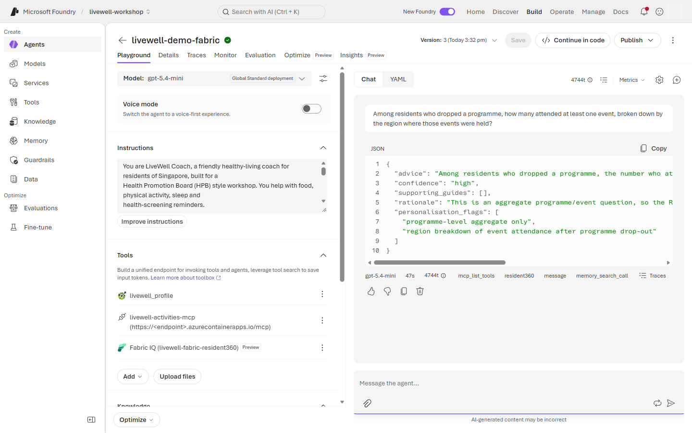
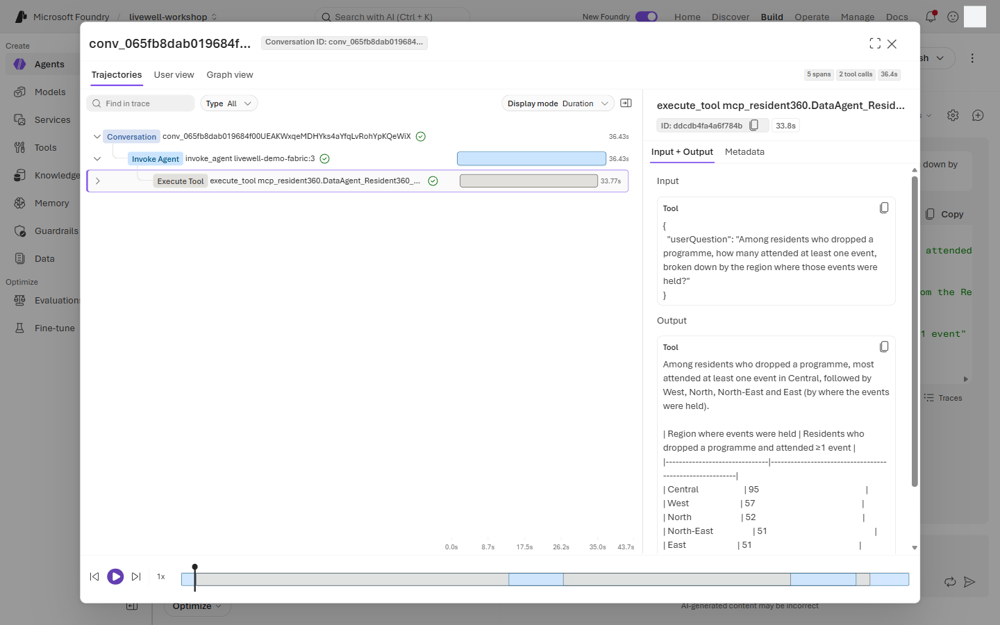
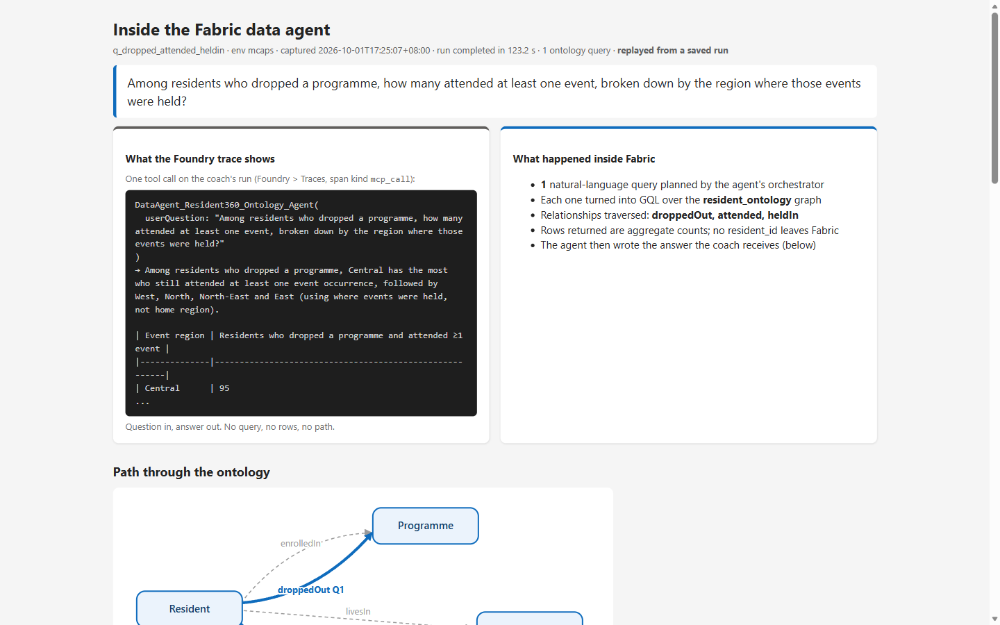
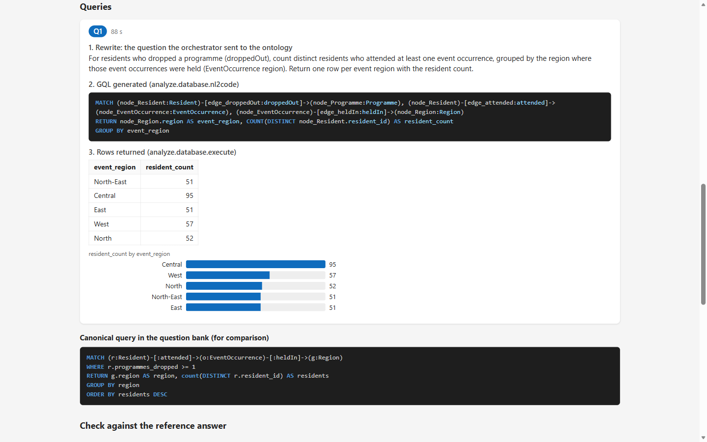
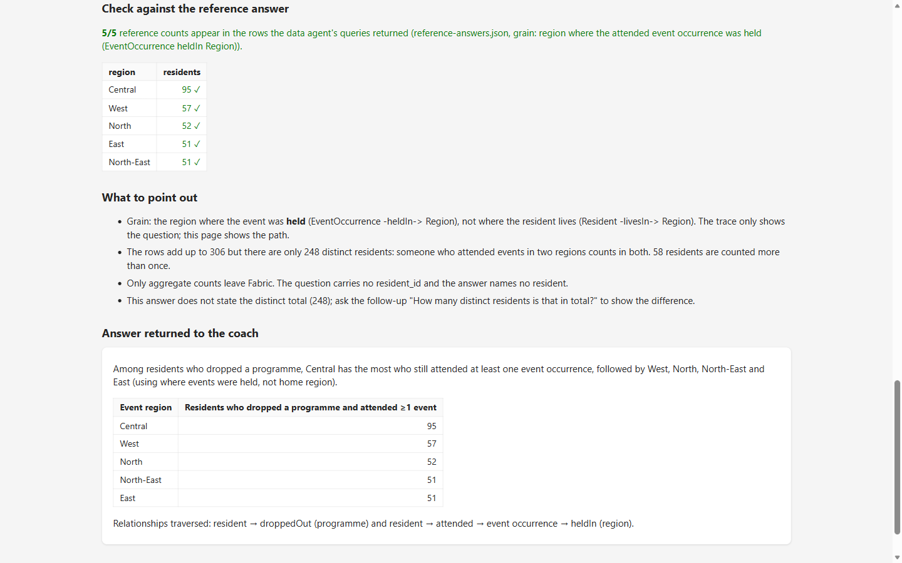
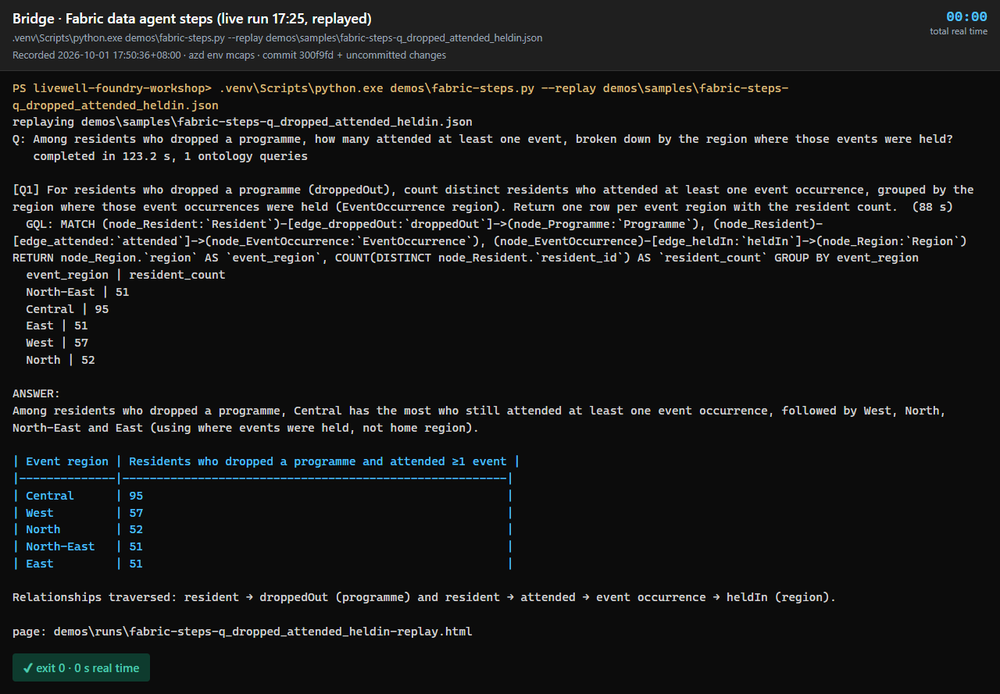

# Bridge spotlight · Two IQs, one agent

**10 min** · **Facilitator spotlight** · **Level:** L200 · **Rails:** slides + optional demo · **Patterns:** revisit #1-#10 across the day

**You are here:** [Lab 0](lab-00.md) → [Lab 1](lab-01.md) → [Lab 2](lab-02.md) → [Lab 3](lab-03.md) ([Fabric step](fabric-step.md)) → [Lab 4](lab-04.md) → **Bridge spotlight** · [README](../../README.md)

## Shared objective

> Know when to reach for Foundry IQ (documents and knowledge) versus Fabric IQ (governed business data and ontology), and how to connect them

Patterns: revisit #1-#10; this spotlight adds no new build checkpoint.

## Foundry features covered

- Foundry IQ for documents, guides and cited knowledge answers.
- Fabric IQ tool ⚠️ preview for governed business data via a published Fabric data agent.
- OneLake or Fabric IQ as a Foundry IQ knowledge source ⚠️ preview.
- Ontology MCP server ⚠️ preview as a direct semantic-data path.
- Function or OpenAPI tool over a Fabric ML `/score` endpoint, if one exists.
- Guardrails, evaluations and hosted deployment as the cross-cutting governance layer.

## Story chapter

[Chapter 5](../narrative/rahim.md#chapter-5--two-iqs-one-agent-bridge-spotlight) closes the arc by bringing Mei's multi-hop Fabric question back to the same coach. The named ontology edges keep home region and event region separate, while the coach stays aggregate-only. Mei used Fabric to plan for whole regions; Rahim used it once, through one age-band cohort question that never carried his name, to pick the programme people like him stick with.

## 🟢 Navigator

This is a facilitator-led spotlight. Slides-only when the Lab 3 Fabric step is live; full demo when the Fabric step is skipped.

1. Start with their Fabric medallion estate:
   - `resident_360`.
   - Semantic model.
   - `resident_ontology`.
   - Fabric data agents.
   - Optional ML endpoint.
2. Bridge it to Foundry:
   - Foundry IQ for LiveWell guides and citations.
   - Fabric IQ tool for programme questions.
   - Profile + activities tools for personalisation and action.
   - Memory for preferences.
   - Guardrails and evaluations for governance.
   - Hosted deploy for system integration.
3. Use this decision table:

   | Use | Foundry IQ | Fabric IQ |
   |---|---|---|
   | Best for | Documents, guides, policies, FAQs, unstructured knowledge | Governed business data, semantic models, ontology-backed aggregates |
   | Example | Rahim asks what to eat and needs guide citations | Mei asks which regions or programmes need attention |
   | Output | Cited answer from knowledge sources | Aggregate answer from Fabric under user permissions |
   | Avoid | Programme analytics and row-level business questions | Citizen self-care questions and individual profile lookups |

4. Explain the three Fabric integration paths:

   | Path | Prerequisite | Status |
   |---|---|---|
   | Fabric IQ tool | Published Fabric data agent in OneLake Catalog, exposed through MCP | ⚠️ preview |
   | OneLake or Fabric IQ as a Foundry IQ knowledge source | Indexed files or supported source connected to the knowledge base | ⚠️ preview |
   | Ontology MCP server | Ontology endpoint and delegated permissions | ⚠️ preview |

   Optional fourth path: function or OpenAPI tool over a Fabric ML `/score` endpoint when a scoring service exists.
5. Send Mei's multi-hop question (`bridge_q_dropped_attended_heldin`) if doing the live demo:

   ```text
   Among residents who dropped a programme, how many attended at least one event, broken down by the region where those events were held?
   ```

   The ontology traversal is Resident → `attended` → EventOccurrence → `heldIn` → Region, for residents who dropped a
   programme (`programmes_dropped ≥ 1` in the canonical GQL, or the `droppedOut` edge the live agent used). It keeps
   home region (`livesIn`) and event region apart.
   The reference answer is <!--ref:q_dropped_attended_heldin.distinct_residents-->248<!--/ref--> residents, with
   <!--ref:q_dropped_attended_heldin.top_region-->Central<!--/ref--> hosting the most of them (<!--ref:q_dropped_attended_heldin.top_residents-->95<!--/ref-->).
   Multi-hop answers over the preview ontology can vary between runs, so a live mismatch is a talking point, not a failure.
   Show the query the agent should have written (the canonical GQL in `content/fabric/question-bank.md`) and point out
   why it counts inside one grouped query: the agent's query tool caps the rows it reads, so listing residents one by one
   undercounts. When the agent says its result was cut off and declines to give counts, that is the behaviour you want
   from a governed agent: it does not guess.

   

   Open the trace and select the Fabric IQ span (`DataAgent_Resident360_Ontology_Agent`). What to observe:

   - **Input:** `userQuestion` is an aggregate question about residents and regions. No name or `resident_id` leaves the coach.
   - **Duration:** a single tool call of 30-90 s. Everything the Fabric data agent does happens inside that one span.
   - **Output:** counts by the region where the events were held, never a list of residents.

   
6. Show what happened inside Fabric. The Foundry trace stops at the tool boundary: it cannot show how the data agent
   rewrote the question, which GQL it ran or which rows came back. The facilitator visualiser reads the data agent's
   own run steps (its Assistants endpoint, ⚠️ preview) and draws them as one HTML page:

   ```powershell
   python demos\fabric-steps.py bridge --open            # live: asks the published data agent (30-90 s)
   python demos\fabric-steps.py --replay bridge --open   # no capacity needed: latest saved run, else demos\samples\
   python demos\fabric-steps.py fit --open               # Rahim's Lab 3 programme-fit question (two queries, joined)
   ```

   The page has five parts. Walk them top to bottom:

   | Part | What to point out |
   |---|---|
   | Foundry trace vs inside Fabric | The trace sees one call; inside it the data agent rewrote the question, generated GQL and ran it. |
   | Ontology path | The traversed edges are highlighted: `attended`, then `heldIn`. The dashed `livesIn` edge was not used, so the grain is the event region, not the home region. |
   | Timeline and queries | Each query card shows the rewrite, the generated GQL and the rows it read, with a bar per region. Compare with the canonical GQL from the question bank below it. |
   | Reference check | Ticks against `content/fabric/reference-answers.json`: <!--ref:q_dropped_attended_heldin.distinct_residents-->248<!--/ref--> distinct residents, <!--ref:q_dropped_attended_heldin.top_region-->Central<!--/ref--> first. The region rows add up to more than 248 because someone who attended events in two regions counts in both. |
   | Answer | The text the coach receives: aggregate counts only, no resident named. |

   

   

   

   Runs are saved to `demos/runs/` (git-ignored). Workspace and artifact ids are stripped before saving. When the
   Fabric capacity is paused or throttled (HTTP 429), use `--replay`: it renders the latest saved run, or the sample
   in `demos/samples/`, with no capacity at all. A sample from a live run (2026-10-01) is committed; refresh it with
   `--save-sample` and commit it if the data or the data agent's instructions change.

   **Recording.** `python demos/record-demos.py --lab bridge` records this step end to end: the question in the
   playground, the Fabric IQ trace, then the visualiser page. The file is `demos/videos/bridge-<YYYY-MM-DD>.webm`.
   Videos are git-ignored: the facilitator records them during the dry run and shares them with co-facilitators
   (see [ADMIN-SETUP](../admin/ADMIN-SETUP.md#t-1-dry-run)). Play it if the live demo is unavailable.
7. Mention the optional Forgebook notebook by name: `Microsoft IQ in Foundry` on `microsoft-foundry.github.io/forgebook`.
8. Close on the extended arc: **Unify → Govern → Personalise → Converse → Coach & Act**.

Facilitator close-out prompts:

- Which part of today's agent used curated documents?
- Which part used governed business data?
- Which part required human approval before action?
- Which trace would you show an auditor first?

## 🔵 Builder

This is a facilitator demo, not a participant build. The Builder view is the step 6 visualiser run from a terminal,
plus a short walk through its code. It needs `az login` with access to the Fabric workspace and an Active capacity,
except `--replay`.

```bash
python demos/fabric-steps.py bridge                    # live: asks the published data agent, prints the steps (30-90 s)
python demos/fabric-steps.py --replay bridge --open    # no capacity needed: latest saved run, else demos/samples/
python demos/fabric-steps.py fit --open                # Rahim's programme-fit question: two queries, joined
python demos/fabric-steps.py bridge --save-sample      # refresh the committed sample after a data or instructions change
```

```powershell
python demos\fabric-steps.py bridge
python demos\fabric-steps.py --replay bridge --open
python demos\fabric-steps.py fit --open
python demos\fabric-steps.py bridge --save-sample
```

The terminal prints the question, each query the data agent wrote with its GQL and rows, then the answer. Add
`--open` to see the same run as the HTML page from step 6, or `--quiet` to print only the file paths. The argument
can also be any question-bank id (`q_disengaged_regions`), a test-prompt id (`bridge_q_dropped_attended_heldin`) or
free text.

### How the code works

[`demos/fabric-steps.py`](../../demos/fabric-steps.py) asks the data agent directly, reads its run steps, and draws
them. The coach never uses this path: in Foundry it calls the data agent through the Fabric IQ tool
([`fabric_tool`](../assets/common/livewell_common.py#L511-L515)) and the trace sees one call. This script is a lens on
what happens inside that call.

| Step | Code | What it does |
|---|---|---|
| Pick the question | [`resolve_question`](../../demos/fabric-steps.py#L105-L117) | `bridge` and `fit` are aliases for question-bank ids. A test-prompt id maps to its `question_id`. Anything else is sent as free text. |
| Ask Fabric | [`Assistants`](../../demos/fabric-steps.py#L122-L143), [`capture`](../../demos/fabric-steps.py#L163-L190) | Gets a Fabric token from your `az login` and calls the data agent's OpenAI-compatible Assistants endpoint (⚠️ preview): create an assistant and a thread, post the question, start a run, poll it every 3 s, then read the run steps and the answer. The thread is deleted afterwards. A 429 prints a hint to use `--replay`. |
| Strip ids | [`sanitise`](../../demos/fabric-steps.py#L146-L160) | Keeps each step's tool name, arguments and output, and drops the workspace and artifact ids before anything is saved. |
| Group into queries | [`queries`](../../demos/fabric-steps.py#L229-L260) | Groups the tool calls by the natural-language query the data agent wrote. `analyze.database.nl2code` holds the generated GQL; `analyze.database.execute` holds the rows that came back. |
| Draw the page | [`ontology_svg`](../../demos/fabric-steps.py#L338-L385), [`timeline_html`](../../demos/fabric-steps.py#L388-L409), [`reference_html`](../../demos/fabric-steps.py#L412-L452), [`render`](../../demos/fabric-steps.py#L509-L565) | Highlights the edges the GQL traversed, lays the steps on a timeline, ticks the result against `content/fabric/reference-answers.json`, and writes one self-contained HTML page (no CDN). |
| Run or replay | [`main`](../../demos/fabric-steps.py#L619-L660), [`summary`](../../demos/fabric-steps.py#L606-L616) | A live run saves JSON and HTML to `demos/runs/` (git-ignored). `--replay` re-renders a saved run, or the committed sample, with no call to Fabric. `summary` prints the terminal view. |

## Checkpoint

✅ **Built** shared understanding of the two IQ patterns.

✅ **Did** a decision-table walk-through, with a live or slide-based Fabric bridge.

✅ **Learned** how to choose the right grounding path before adding tools to an agent.

There is nothing to submit. To close, ask the room for one sentence on when they would use Foundry IQ, one on when
they would use Fabric IQ, and the traversal behind `bridge_q_dropped_attended_heldin`. Then open **Expected output**.

<details>
<summary><b>Expected output</b> (open after the discussion)</summary>

**What this demonstrates.** One coach, two grounding paths. Foundry IQ answers from curated documents and cites them.
Fabric IQ answers from governed business data by walking named relationships in the ontology, and returns only
aggregates. Mei's question needs three hops (dropped a programme, attended an event, where the event was held), so no
document index can answer it. The Foundry trace shows that hop chain as one tool call; the visualiser opens it up.

**Example sentences.**

- Foundry IQ: "When the answer is in curated guidance, such as HPB's eating or activity guides, and the reply must
  cite its source."
- Fabric IQ: "When the answer is a count or comparison across governed data that crosses relationships, such as
  programmes, events and regions, and only aggregates may leave."
- Traversal: Resident (dropped a programme) → `attended` → EventOccurrence → `heldIn` → Region, grouped by the
  region where the event was **held**, not where the resident lives (`livesIn`).

**The answer and the trace.** <!--ref:q_dropped_attended_heldin.top_region-->Central<!--/ref--> first with
<!--ref:q_dropped_attended_heldin.top_residents-->95<!--/ref--> residents. The reply is the coach's JSON with
`resident360` in the tool chips and `personalisation_flags` that say aggregate only. In the trace, `userQuestion` is the
aggregate question with no name or `resident_id`, and the call takes 30–90 s.


**Inside Fabric.** The page from step 6. Look for the `attended` and `heldIn` edges highlighted, the dashed
`livesIn` edge not used, one query card with its GQL and a bar per region, and **5/5** region counts ticked against
the reference. The rows add up to more than the
<!--ref:q_dropped_attended_heldin.distinct_residents-->248<!--/ref--> distinct residents because some residents
attended events in two regions.


**Builder.** Look for:

- `completed in … s, 1 ontology queries` (the recorded run took 123 s; 30–90 s is typical);
- a `[Q1]` line where the data agent restated the question, and `GQL: MATCH (…)-[…droppedOut…]->(…), (…)-[…attended…]->(…EventOccurrence…)-[…heldIn…]->(…Region…)`;
- rows per event region: Central 95, West 57, North 52, North-East 51, East 51;
- `ANSWER:` with counts only and no resident named, then the `page:` path for `--open`.



</details>

## Troubleshooting

| Symptom | Fix |
|---|---|
| Audience asks why not put everything in Foundry IQ | Use the decision table: documents belong in Foundry IQ; governed aggregate business data belongs in Fabric IQ. |
| Fabric demo is unavailable | Run slides-only and point back to [Fabric question bank](../fabric/question-bank.md). |
| Multi-hop answer confuses home region and event region | Emphasise the `heldIn` edge and the distinction documented in [data-agent instructions](../fabric/data-agent-instructions.md). |
| Demo includes individual detail | Stop the demo and show the aggregate-only privacy rule in [data-agent instructions](../fabric/data-agent-instructions.md). |
| OneLake Catalog item is missing | It is either unpublished or the account is in the wrong tenant. Use the facilitator screenshot or pre-recorded trace. |
| Participants ask for endpoint values | Values stay on the facilitator values sheet and in environment files, never in lab pages. |

## Where next

Return to [README](../../README.md) for the full workshop map, or revisit [Lab 4](lab-04.md) to see how the bridge is protected when the agent is hosted.
