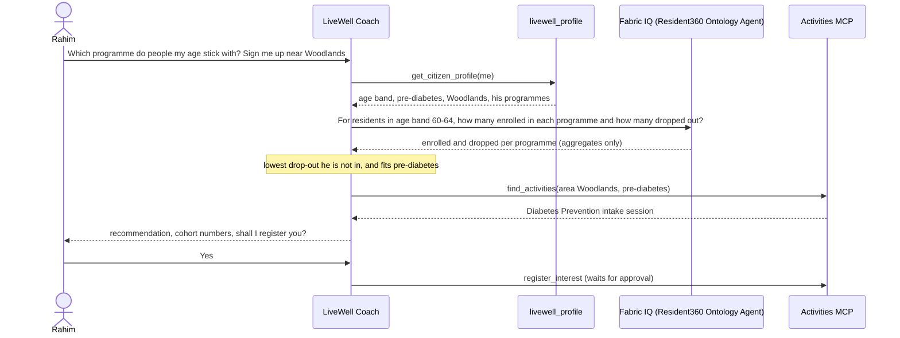
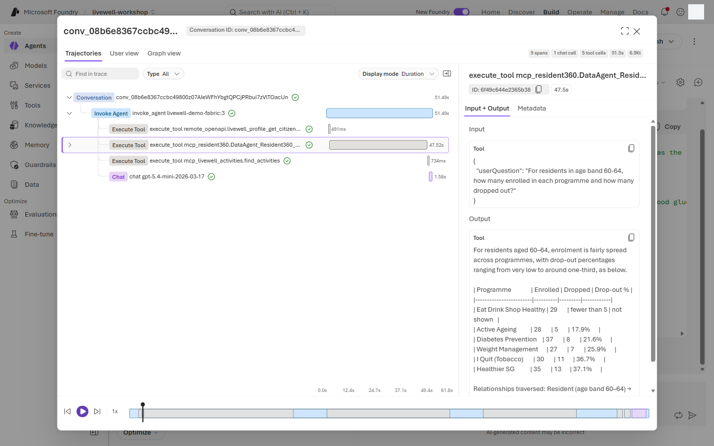
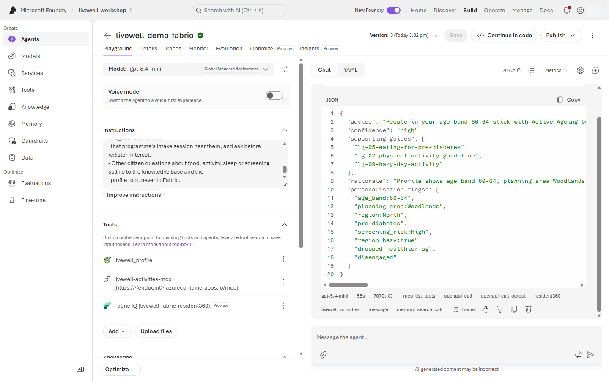
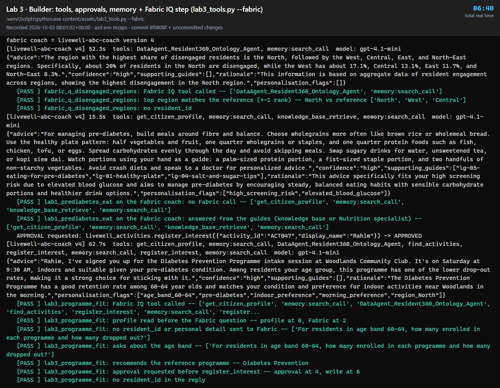

# Fabric step · Add the Resident 360 data agent as a Fabric IQ tool

**15 min** · **Optional** · **When:** `FABRIC_BRIDGE=true` · **Level:** L300 · **Rails:** 🟢 Navigator + 🔵 Builder · **Patterns:** #2 Evidence-Based Decision Support · #3 Workflow Orchestration · #6 Human-in-the-Loop Review · #8 Institutional Memory · #9 Collaboration Between Specialists

**You are here:** [Lab 0](lab-00.md) → [Lab 1](lab-01.md) → [Lab 2](lab-02.md) → [Lab 3](lab-03.md) (**Fabric step**) → [Lab 4](lab-04.md) → [Bridge spotlight](bridge-spotlight.md) · [README](../../README.md)

## Shared objective

> An agent that acts: personalise on governed data, take real actions with a human in the loop, delegate to specialists, and route each kind of question to the right tool

Patterns: #2 Evidence-Based Decision Support; #3 Workflow Orchestration; #6 Human-in-the-Loop Review; #8 Institutional Memory; #9 Collaboration Between Specialists.

## Foundry features covered

- Fabric IQ tool ⚠️ preview, connected to a published Fabric data agent through OneLake Catalog and MCP.
- Project connection **`livewell-fabric-resident360`**.
- Identity passthrough: participants must use the same workshop account in Foundry and Fabric. For what this means in a real deployment, see [what is fixed for the workshop](lab-03.md#workshop-shortcuts).
- Multi-step tool chaining in one turn: profile tool → Fabric IQ → activities MCP → approval-gated action.
- Privacy by design: the coach asks Fabric an aggregate cohort question (age band only), never about a person.
- Tool routing instructions that separate citizen guide questions, Rahim's one cohort question and officer programme questions.
- Trace validation: what the coach sent to Fabric, Fabric IQ for Mei's question, and no Fabric call for Rahim's food question.
- Fabric ontology and data agent ⚠️ preview over the Resident 360 estate, including the `droppedOut` edge.

## Story chapter

[Chapter 3](../narrative/rahim.md#chapter-3--its-hazy-today--what-can-i-do-indoors-lab-3--tools-mcp--memory) ends with two Fabric beats. In ch3.6 Rahim admits he dropped out of <!--ref:q_programme_fit.dropped_programme-->Healthier SG<!--/ref--> and asks which programme people his age actually stick with. The guides know *what* helps with pre-diabetes; only the governed Resident 360 knows *who stays*. In ch3.7 Mei asks a region-level planning question. The coach calls Fabric for both, but for Rahim it asks about his age band, never about him, and it still answers his food questions from Foundry IQ.

### Why Fabric makes this answer better

Without Fabric the coach can only say "any of these programmes could help". With Fabric it can reason over four sources in one turn:

| Step | Source | What the coach learns |
|---|---|---|
| 1 | `livewell_profile` (his own record) | Age band <!--ref:q_programme_fit.age_band-->60-64<!--/ref-->, pre-diabetes, High screening risk, Woodlands, the programmes he is in or dropped |
| 2 | Fabric IQ (Resident 360 ontology) | For the <!--ref:q_programme_fit.cohort_residents-->97<!--/ref--> residents in his age band: how many joined each programme and how many dropped out |
| 3 | Its own reasoning | <!--ref:q_programme_fit.dropped_programme-->Healthier SG<!--/ref--> lost <!--ref:q_programme_fit.dropped_programme_dropout_pct-->37.1<!--/ref-->% of them; <!--ref:q_programme_fit.recommended_programme-->Diabetes Prevention<!--/ref--> lost <!--ref:q_programme_fit.recommended_dropout_pct-->21.6<!--/ref-->%, the lowest of the programmes he is not already in, and it targets his glucose |
| 4 | Activities MCP | The <!--ref:q_programme_fit.recommended_programme-->Diabetes Prevention<!--/ref--> intake session near Woodlands, then `register_interest` after he approves |



Privacy is part of the design. The question sent to Fabric names only the age band: no name, resident_id, planning area or gender. Adding his screening risk would shrink the cohort to about twenty people and every drop-out count would fall under the "fewer than 5" rule, so the cohort stays at age band only. Any count under five is reported as "fewer than 5".

## 🟢 Navigator

Prerequisites the facilitator completed:

- Fabric workspace **`HPB Resident 360`** is deployed.
- Lakehouse **`lh_resident360`** is loaded.
- Ontology **`resident_ontology`** exists; see [ontology blueprint](../fabric/ontology.blueprint.yaml).
- Published data agent **`Resident360 Ontology Agent`** exists with instructions from [data-agent instructions](../fabric/data-agent-instructions.md).
- Project connection **`livewell-fabric-resident360`** exists.
- Participants are signed in with the same account in Foundry and Fabric.
- User identity passthrough is enabled, and published agents appear in the OneLake Catalog.

Steps:

1. Open your Lab 3 agent and check that **Model** shows **`gpt-4.1-mini`** (Lab 3 step 1). The programme-fit prompt chains the Fabric IQ tool with the OpenAPI profile tool, which needs that model; if the agent is still on `gpt-5-mini`, switch it now and select **Save**.
2. Go to **Tools** → **Add** → **Add tools** → **Configured** → **Fabric IQ (OneLake Catalog)** ⚠️ preview → **Add tool**, and filter the catalog by `Resident360`.
3. Pick **`Resident360 Ontology Agent`** → **Add**, or, if the facilitator pre-created it, select the existing connection **`livewell-fabric-resident360`** on the **Configured** tab → **Add tool**.
4. In **Instructions**, append the `fabric` block from [coach-instructions.md](../prompts/coach-instructions.md). Link to the file; do not copy from this lab page.
5. Start a new conversation as Rahim. Send (`lab3_programme_fit`):

   ```text
   I dropped out of Healthier SG last year. Which programme do people my age actually stick with? Find me a way to start near Woodlands and sign me up.
   ```

   Expect, in order: the profile call, one Fabric IQ call (**30-90 s**), `find_activities`, then an approval card for
   `register_interest`. The reply should recommend **<!--ref:q_programme_fit.recommended_programme-->Diabetes Prevention<!--/ref-->**
   (<!--ref:q_programme_fit.recommended_dropout_pct-->21.6<!--/ref-->% drop-out in his age band against
   <!--ref:q_programme_fit.dropped_programme_dropout_pct-->37.1<!--/ref-->% for <!--ref:q_programme_fit.dropped_programme-->Healthier SG<!--/ref-->) and offer
   its intake session in Woodlands.

   Open the trace and select the Fabric IQ call. Its `userQuestion` argument is what left the coach. It should name
   the age band and nothing else. Approve the card to finish the sign-up.
6. Start a new conversation as Mei, the programme officer. Send (`fabric_q_disengaged_regions`):

   ```text
   Which regions have the highest share of disengaged residents?
   ```

   Expect the trace to show a Fabric IQ MCP call. Latency of **30-90 s** is normal for the preview path.
   The reference answer ranks **<!--ref:q_disengaged_regions.top_region-->North<!--/ref-->** first (<!--ref:q_disengaged_regions.top_share_pct-->20.0<!--/ref-->% of
   its residents are disengaged), then <!--ref:q_disengaged_regions.second_region-->West<!--/ref--> (<!--ref:q_disengaged_regions.second_share_pct-->17.1<!--/ref-->%).
7. Start a new conversation as Rahim. Send (`lab1_prediabetes_eat`):

   ```text
   My screening says my glucose is high. What should I eat to manage pre-diabetes?
   ```

   Confirm the trace shows knowledge-base retrieval and **no Fabric call**.

Routing rule to keep in mind:

| Seat | Question type | Expected tool |
|---|---|---|
| Rahim | Food, activity, sleep, screening, personal self-care | Foundry IQ knowledge base plus profile tool |
| Rahim | Which programme people like him stick with | Profile tool, then Fabric IQ with his age band only, then activities MCP |
| Rahim | Individual profile | Profile tool only, never Fabric |
| Mei | Region, programme, event, challenge aggregates | Fabric IQ tool |
| Anyone | Another resident's data | Refuse |

Routing matters as much as the answer. A correct region table that came through the wrong tool is still wrong. A good programme recommendation is still a failure if the question sent to Fabric included Rahim's name or area.

## 🔵 Builder

```bash
python content/assets/lab3_tools.py --fabric
```

Same in bash and PowerShell. Run it only once the facilitator confirms the Fabric step is on. Run Cell ignores flags, so for cell-by-cell runs set `FABRIC_BRIDGE=true` in `content/assets/.env` instead of `--fabric`.

Or open `content/assets/lab3_tools.py` and run the Fabric cells after the main Lab 3 cells. Use this only when the facilitator confirms `FABRIC_BRIDGE=true`.

What the script does per cell:

1. Loads the Fabric-enabled tool configuration from the environment.
2. Attaches the project connection **`livewell-fabric-resident360`** to the coach.
3. Appends the `fabric` instruction block from [coach-instructions.md](../prompts/coach-instructions.md).
4. Runs `fabric_q_disengaged_regions` and records the Fabric IQ MCP trace line.
5. Runs `lab1_prediabetes_eat` in the same agent and asserts no Fabric tool call is used.
6. Runs `lab3_programme_fit`, approves `register_interest`, and checks that the profile was read before the Fabric
   call, that the question sent to Fabric names the age band and no personal detail, and that the reply recommends
   the reference programme. The sent question is saved in `.runs/lab3-<INITIALS>.json`.

Use `--verbose` to print tool-call timing. Use `--cleanup` to delete only `livewell-<INITIALS>-*` agents. Optional extension: if a Fabric ML `/score` endpoint exists, the facilitator may expose it as a function tool, but it is not required for the checkpoint.

When `FABRIC_BRIDGE=false`, run Lab 3 without `--fabric`; the profile tool still personalises from [citizens.json](../data/citizens.json).

Keep Fabric disabled in local experiments unless the facilitator confirms the shared connection is ready.

### How the code works

The Fabric step is section 10 of `lab3_tools.py`. It creates a new version of the same coach; there is no new agent.

- **The tool.** [`fabric_tool`](../assets/common/livewell_common.py#L511-L515) returns a `FabricIQPreviewTool` on the project connection `livewell-fabric-resident360`. Foundry calls the published data agent with your own identity (identity passthrough), so Fabric's permissions still apply to you. It only reads aggregates, so no approval is needed. [`fabric_enabled`](../assets/common/livewell_common.py#L128-L129) gates the whole step on `--fabric` or `FABRIC_BRIDGE=true`.
- **The coach, next version.** [Lines 285–290](../assets/lab3_tools.py#L285-L290) call `create_agent` with the Lab 3 tools plus the Fabric tool, and the Lab 3 blocks plus `fabric`. After one run each of Labs 1–3 this is version 4. The `fabric` block is the routing rule from the table above, written for the model.
- **Mei, then the control.** [Lines 292–311](../assets/lab3_tools.py#L292-L311) ask the region question with a longer timeout (`FABRIC_TIMEOUT`, 300 s). The script compares the first region named with `content/fabric/reference-answers.json`, then asks Rahim's food question on the same coach and checks that no Fabric call was made.
- **Programme fit.** [Lines 313–325](../assets/lab3_tools.py#L313-L325) send one prompt. The model chains four tools on its own: profile, then Fabric, then `find_activities`, then the approval for `register_interest`. If it asks "shall I sign you up?" in text instead of raising the approval, the script says yes in the same conversation.
- **The privacy check.** `question_sent` ([lines 327–333](../assets/lab3_tools.py#L327-L333)) pulls the `userQuestion` argument out of each Fabric call: the exact text that left your project for Fabric. [Lines 334–356](../assets/lab3_tools.py#L334-L356) check that it names the age band and not Rahim's id, name or planning area, that the profile call came before the Fabric call, and that the approval came before the write.

`lw.ask` keeps every tool call with its arguments, in order (`run.tool_calls`). That is what makes order and argument checks like these possible in your own tests.

## Checkpoint

✅ **Built** a coach that chains profile, Fabric IQ and activities tools to make one personal decision, and routes officer aggregate questions to Fabric IQ while keeping citizen guidance in Foundry IQ.

✅ **Did** a programme-fit run with an approval, one Fabric IQ trace check for Mei and one no-Fabric citizen check.

✅ **Learned** that Fabric IQ adds governed population evidence to a personal answer, as long as the question sent to it stays aggregate.

There is nothing to submit. Try the steps first, then open **Expected output** to compare.

<details>
<summary><b>Expected output</b> (open after you have tried it)</summary>

**What this demonstrates.** Fabric IQ adds population evidence to a personal decision. For `lab3_programme_fit` the coach reads Rahim's profile, asks Fabric one aggregate question about his age band, picks a programme people his age stay in and that he is not already in, finds its intake session near Woodlands, and asks before registering him. The same coach routes Mei's aggregate question to Fabric and keeps Rahim's food question on the guides. Foundry IQ answers "what is good advice"; Fabric IQ answers "what happens to people like me".

**The question that left the project.** In the `lab3_programme_fit` trace, select the Fabric call. `userQuestion` names the age band and nothing else. The output is a table by programme with enrolled, dropped and drop-out %. Counts under 5 show as "fewer than 5", the small-cell rule from the data-agent instructions.



**The recommendation.** Active Ageing has the lowest drop-out in the table, but Rahim is already in it. The coach recommends **<!--ref:q_programme_fit.recommended_programme-->Diabetes Prevention<!--/ref-->** (<!--ref:q_programme_fit.recommended_dropout_pct-->21.6<!--/ref-->% drop-out against <!--ref:q_programme_fit.dropped_programme_dropout_pct-->37.1<!--/ref-->% for <!--ref:q_programme_fit.dropped_programme-->Healthier SG<!--/ref-->, which he dropped) and offers its intake session. The tool chips show `openapi_call` (profile), `resident360` (Fabric) and `livewell_activities`.



**Mei's question.** `fabric_q_disengaged_regions` returns **<!--ref:q_disengaged_regions.top_region-->North<!--/ref-->** first (±1 rank is fine), by region and with no `resident_id`. `resident360` appears in the chips.


**The control.** `lab1_prediabetes_eat` on the same coach: the profile and the knowledge base only, with **no Fabric call**.


**Builder.** Look for:

- `fabric coach = livewell-<INITIALS>-coach version 4` (one above your Lab 3 version if you re-ran a lab);
- the region answer with `DataAgent_Resident360_Ontology_Agent` in its tools (first call 60–120 s) and `top region matches the reference`;
- the food question with `get_citizen_profile` and `knowledge_base_retrieve`, but no Fabric tool;
- programme fit: `profile at 0, Fabric at 2`, the question sent (`For residents in age band 60-64, how many enrolled in each programme and how many dropped out?`), then `APPROVAL requested: …register_interest({"activity_id":"ACT047",…}) -> APPROVED` and a Diabetes Prevention intake confirmation.



</details>

## Troubleshooting

| Symptom | Fix |
|---|---|
| Data agent is not in OneLake Catalog | It may not be published, or you may be signed into a different tenant/account. Use the same workshop account in Foundry and Fabric. |
| 403 from Fabric | Ask the facilitator to confirm read access on **`Resident360 Ontology Agent`** for your workshop account. |
| Graph query failing | Facilitator refreshes the graph model `resident_ontology_graph_*` from Fabric: Schedule → Refresh now. |
| Fabric call is slow | Normal preview latency is **30-90 s**; wait before retrying. |
| Citizen food question calls Fabric | Re-copy the `fabric` routing block and verify the knowledge base remains attached. |
| Programme-fit question sent Rahim's area, name or risk to Fabric | Re-copy the `fabric` block; it fixes the question to the age band only. Run the prompt again in a new chat. |
| Programme-fit question names the wrong age band (not <!--ref:q_programme_fit.age_band-->60-64<!--/ref-->), with no profile call before Fabric | The model guessed his age. Re-copy the current `fabric` block: step a makes the profile call come first and step b copies `age_band` from it. Run the prompt again in a new chat. |
| Coach recommends a programme Rahim is already in, or <!--ref:q_programme_fit.dropped_programme-->Healthier SG<!--/ref--> again | Check the profile call ran first; the `programmes` field lists his active and dropped programmes. |
| No intake session found | The activities MCP server needs the latest `activities.json` (the intake session has a `programme` field). The facilitator runs `azd deploy mcp-activities`. |
| Fabric shows a count under 5 as a number | Ask the facilitator to re-apply the [data-agent instructions](../fabric/data-agent-instructions.md) small-cell rule. |
| Fabric answer includes individual detail | Stop and re-run after the facilitator checks [data-agent instructions](../fabric/data-agent-instructions.md); Fabric answers must be aggregate-only. |
| `FABRIC_BRIDGE=false` | Skip this page. Lab 3 profile still works from [citizens.json](../data/citizens.json). |

## Where next

Return to [Lab 3](lab-03.md) if you have not completed the activity and memory checkpoints, then continue to [Lab 4](lab-04.md). Keep [README](../../README.md) open for the optional path guidance.
