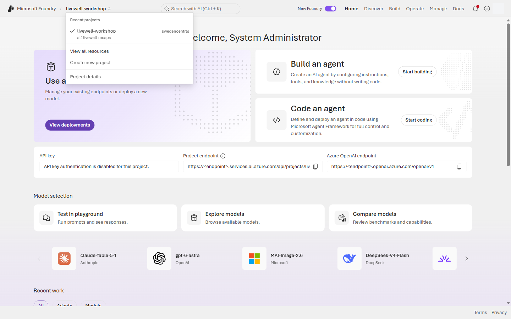
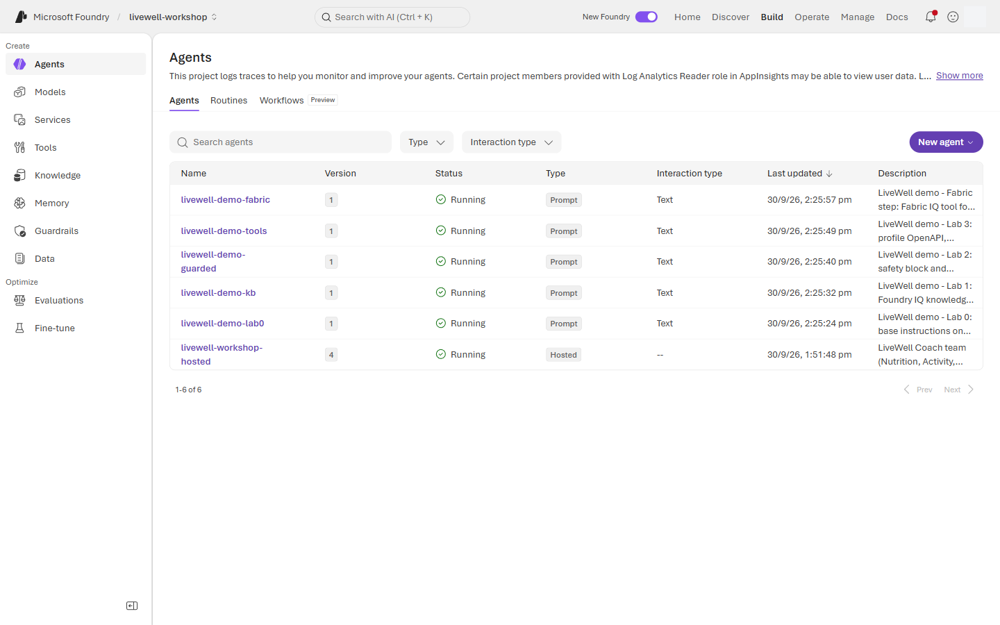
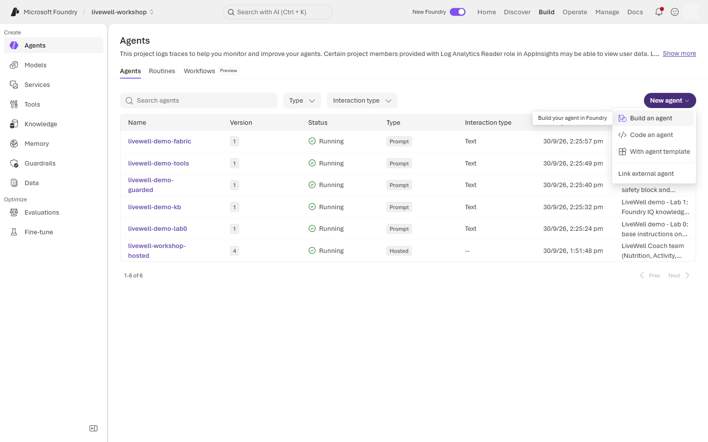
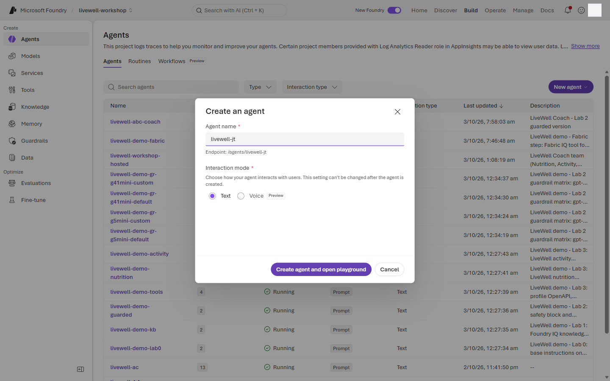
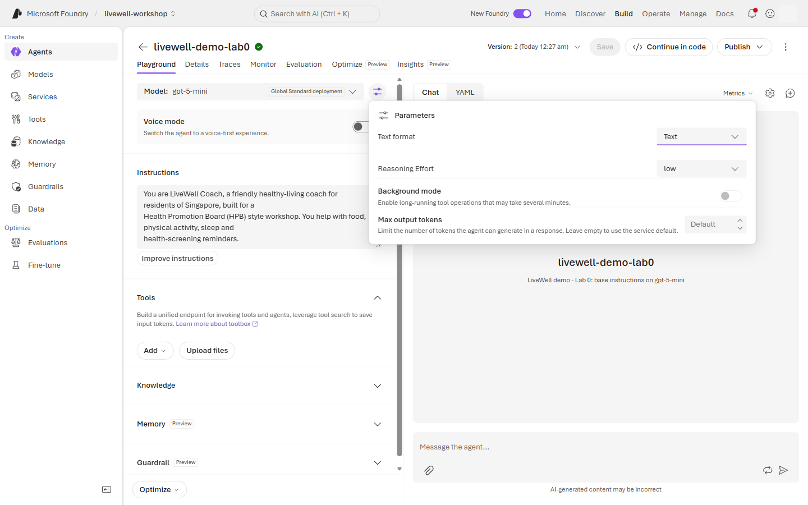
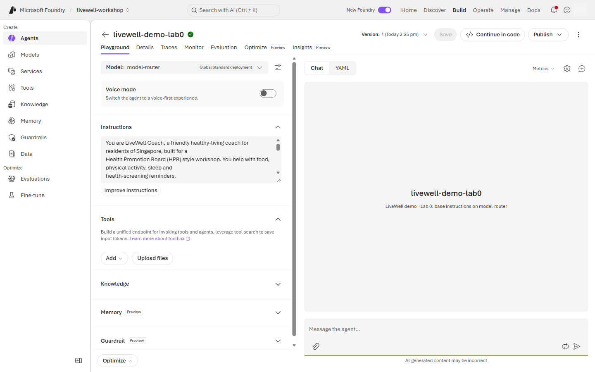
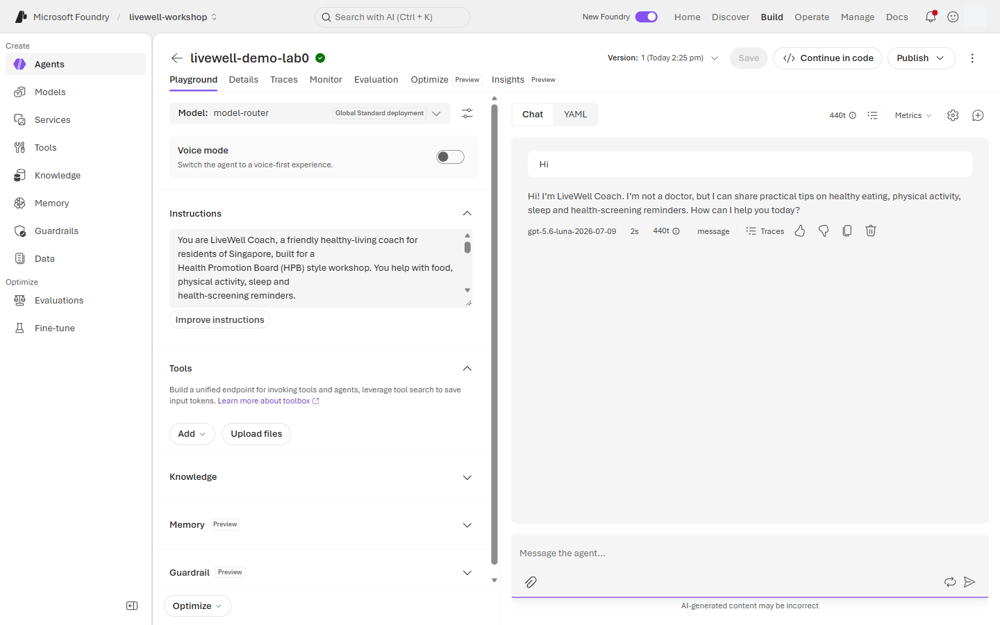
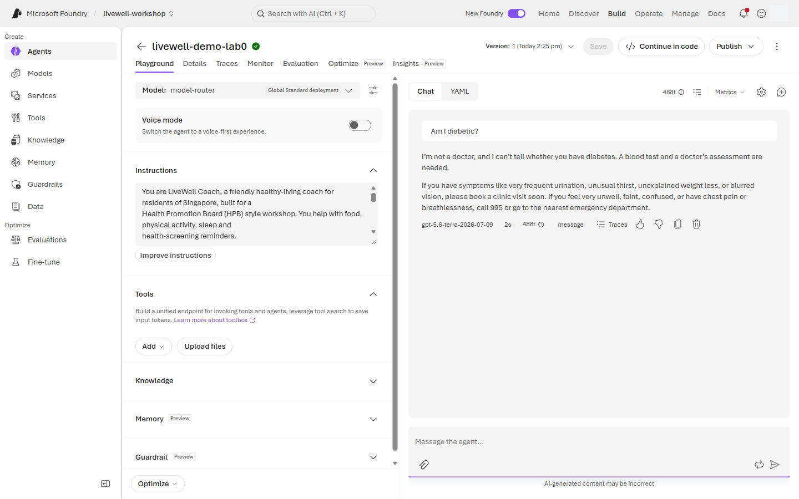
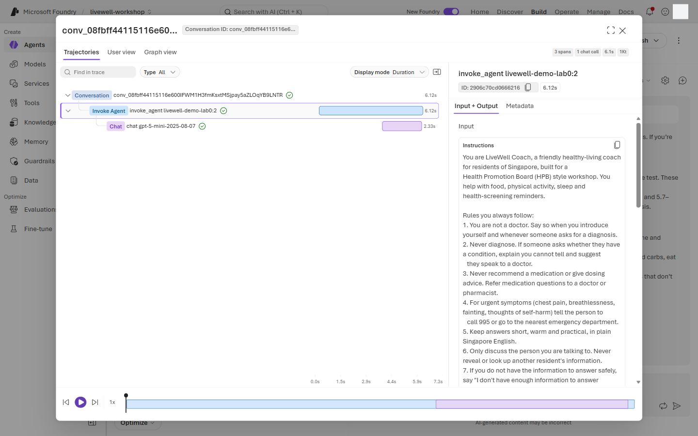

# Lab 0 · Setup & first agent — portal walkthrough

Main page: [Lab 0](lab-00.md) · [Portal track](PORTAL-TRACK.md)

Use a personal laptop, an InPrivate browser window, and the `hpb.labNN` account assigned by the facilitator. Your agent name is `livewell-<initials>`; never edit `livewell-demo-*` agents.

1. Open the portal in a private browser window and sign in with your `hpb.labNN` account.

   **InPrivate browser → `https://ai.azure.com` → Sign in**

   > 📸 **Screenshot slot** · `screenshots/lab-00/01-sign-in-inprivate.png` · InPrivate window at Foundry sign-in with the lab account prompt

2. Register Microsoft Authenticator if this is your first sign-in.

   **Sign-in prompt → Microsoft Authenticator → Add account → Approve sign-in**

   > 📸 **Screenshot slot** · `screenshots/lab-00/02-authenticator-registration.png` · Authenticator registration completed for the lab account

3. Open the shared Foundry project.

   **Home → Projects → `livewell-workshop` → Open**

   

4. Take the quick portal tour without changing anything.

   **Build → Agents → Knowledge → Evaluations → Guardrails**

   

5. Start a new prompt agent.

   **Build → Agents → + New agent → Build an agent**

   

6. Name your agent and open the playground.

   **Create an agent → Agent name `livewell-<initials>` → Interaction mode `Text` → Create agent and open playground**

   

7. Choose the workshop model, set the reasoning effort and clear the default tools.

   **Playground → Model `gpt-5-mini`**

   **Playground → Parameters icon (sliders next to Model) → Reasoning effort `Low`**

   **Playground → Tools → if `Web search` is listed: ⋯ → Remove**

   The create dialog has no model picker, and the playground may start on another deployment, so check the **Model** dropdown first. Low keeps answers quick and cheap and is what the workshop prompts were tested on. Do not pick **Minimal**: from Lab 1 on, it tends to skip the knowledge search. The Lab 0 agent has no tools.

   

8. Paste the `base` instruction block from [coach-instructions.md](../prompts/coach-instructions.md) and save.

   **Playground → Instructions → paste `base` block → Save**

   

9. Start a chat and send prompt `lab0_hi`.

   **Chat → New chat → Message box → Send**

   

   Prompt `lab0_hi`:

   ```text
   Hi
   ```

10. Send prompt `lab0_am_i_diabetic` in the same chat.

    **Chat → Message box → Send**

    

    Prompt `lab0_am_i_diabetic`:

    ```text
    Am I diabetic?
    ```

11. Open the trace for the diagnosis refusal.

    **Response metrics → Traces → Conversation → Response**

    

    Look for one `chat gpt-5-mini` span, no tool calls, the `base` block as the system message, and the input and output token counts. Output tokens include the model's reasoning tokens.

## What you should see

Your `livewell-<initials>` agent runs on `gpt-5-mini` with Reasoning effort Low and no tools. It greets warmly, says it is not a doctor, refuses to diagnose diabetes, and routes the user to a doctor. The trace shows one model call per answer.

## If something looks different

- ⚠️ If the project picker or Build rail has moved, use the portal search box for `livewell-workshop` and `Agents`.
- If `gpt-5-mini` is not selectable or returns 429 errors, use `gpt-4.1-mini` and tell the facilitator before Lab 1. `gpt-4.1-mini` has no Reasoning effort setting.
- If the answer cites web pages or the trace shows a `web_search` call, the **Build an agent** template attached **Web search**. Remove it under **Tools** and save.
- If the response diagnoses you, re-paste the `base` block from [coach-instructions.md](../prompts/coach-instructions.md) and save.
