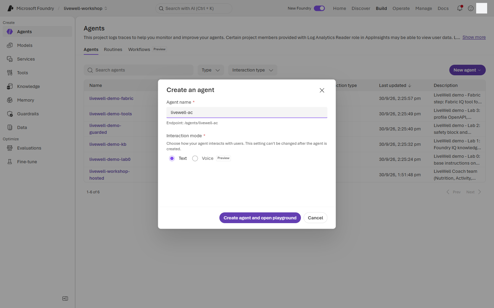
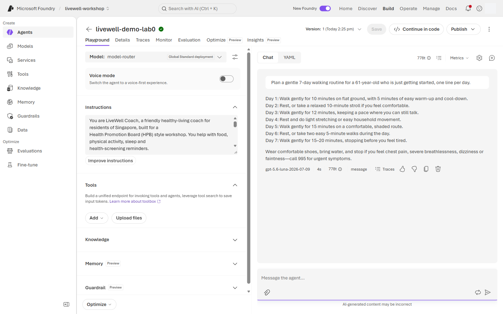

# Lab 0 · Setup & first agent — portal walkthrough

Main page: [Lab 0](lab-00.md) · [Portal track](PORTAL-TRACK.md)

Use a personal laptop, an InPrivate browser window, and the `hpb.labNN` account assigned by the facilitator. Your agent name is `livewell-<initials>`; never edit `livewell-demo-*` agents.

1. Open the portal in a private browser window and sign in with your `hpb.labNN` account.

   **InPrivate browser → `https://ai.azure.com` → Sign in**

   > 📸 **Screenshot slot** · `screenshots/lab-00/01-sign-in-inprivate.png` · InPrivate window at Foundry sign-in with the lab account prompt

2. Register Microsoft Authenticator if this is your first sign-in.

   **Sign-in prompt → Microsoft Authenticator → Add account → Approve sign-in**

   > 📸 **Screenshot slot** · `screenshots/lab-00/02-authenticator-registration.png` · Authenticator registration completed for the lab account

3. Open the shared Foundry project.

   **Home → Projects → `livewell-workshop` → Open**

   

4. Take the quick portal tour without changing anything.

   **Build → Agents → Knowledge → Evaluations → Guardrails**

   

5. Start a new prompt agent.

   **Build → Agents → + New agent → Build an agent**

   

6. Name your agent and choose the workshop router model.

   **Create an agent → Agent name `livewell-<initials>` → Model `model-router` → Create**

   

7. Paste the `base` instruction block from [coach-instructions.md](../prompts/coach-instructions.md) and save.

   **Playground → Instructions → paste `base` block → Save**

   

8. Start a chat and send prompt `lab0_hi`.

   **Chat → New chat → Message box → Send**

   

   Prompt `lab0_hi`:

   ```text
   Hi
   ```

9. Send prompt `lab0_am_i_diabetic` in the same chat.

   **Chat → Message box → Send**

   

   Prompt `lab0_am_i_diabetic`:

   ```text
   Am I diabetic?
   ```

10. Open the trace for the diagnosis refusal.

    **Response metrics → Traces → Conversation → Response**

    

11. Send the router comparison prompt on `model-router`.

    **Configure → Model `model-router` → Save → Chat → New chat → Message box → Send**

    

    Prompt `lab0_router_compare`:

    ```text
    Plan a gentle 7-day walking routine for a 61-year-old who is just getting started, one line per day.
    ```

12. See which model the router selected. The agent's trace records the deployment name (`gen_ai.response.model: "model-router"`), not the model behind it, so read the choice from the model-router deployment's own playground. Each answer there shows the model that served it.

    **Build → Models → `model-router` → Playground → Message box: `Hi!` → Send → then the `lab0_router_compare` prompt → Send → read the model name under each answer**

    

    A greeting usually goes to a small, cheap model, such as `gpt-5-nano`. A plan for a 61-year-old goes to a larger one, such as `gpt-5.6-luna`. The router chooses per request, so your names can differ. The deployment's **Monitor** tab breaks the cost chart down by the underlying model.

13. Compare with the fallback model.

    **Configure → Model `gpt-4.1-mini` → Save → Chat → New chat → Message box → Send**

    

14. Switch your agent back to `model-router` for the rest of the portal track.

    **Configure → Model `model-router` → Save**

    

## What you should see

Your `livewell-<initials>` agent greets warmly, says it is not a doctor, refuses to diagnose diabetes, and routes the user to a doctor. The router comparison produces two reasonable walking plans. The model-router playground shows a different underlying model for the greeting and for the plan.

## If something looks different

- ⚠️ If the project picker or Build rail has moved, use the portal search box for `livewell-workshop` and `Agents`.
- If `model-router` is not selectable, use `gpt-4.1-mini` and tell the facilitator before Lab 1.
- If the response diagnoses you, re-paste the `base` block from [coach-instructions.md](../prompts/coach-instructions.md) and save.
- The agent trace shows `model-router` as the model: that is the deployment name. Use the model-router playground (step 12) to see the underlying model.
- If the model-router playground is not available to your role, note the gap and read the facilitator's demo of the router choice instead.

