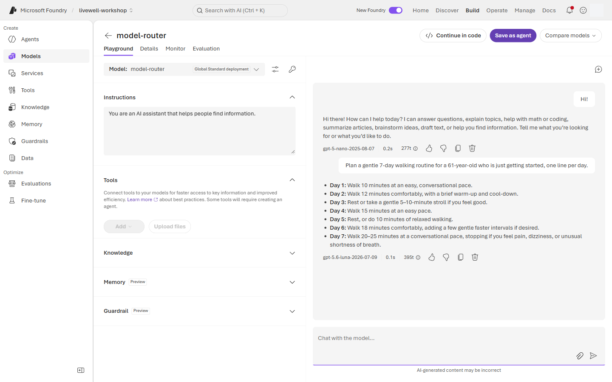
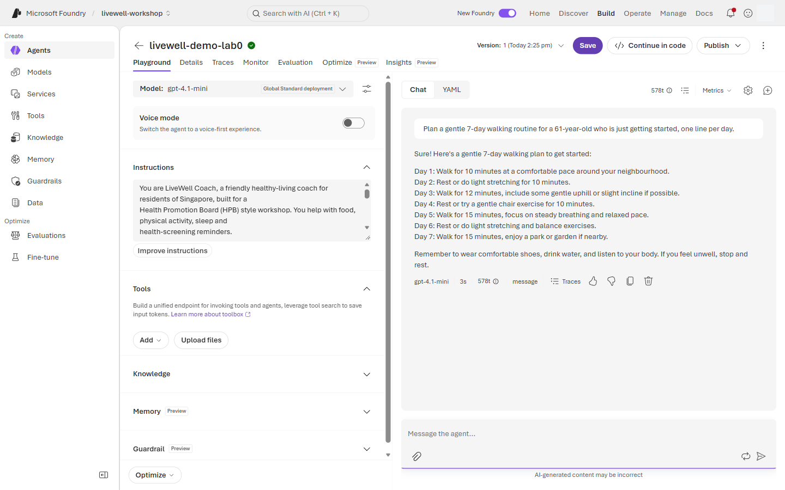
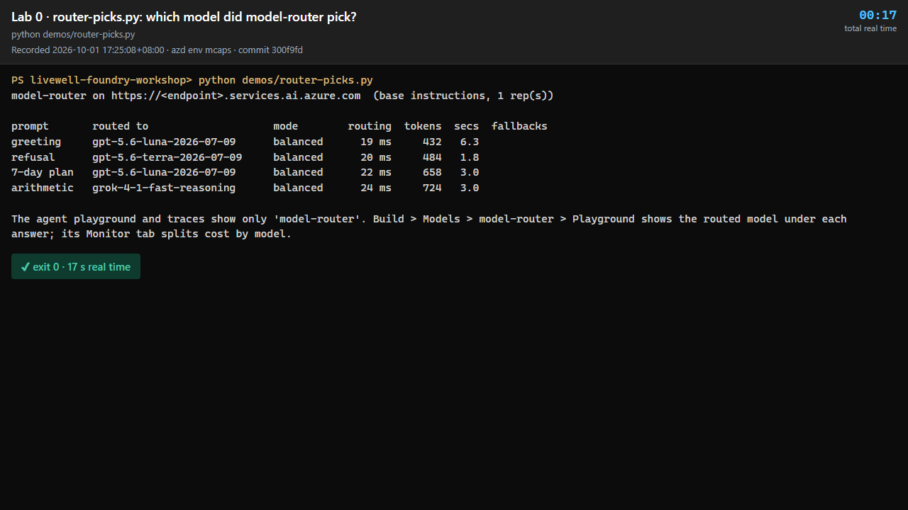

# Lab 0 · Setup & first agent

**15 min** · **Morning** · **Audience:** all rails · **Level:** L100 · **Rails:** 🟢 Navigator portal-only · **Patterns:** #10 Governance & Safety

**You are here:** **Lab 0** → [Lab 1](lab-01.md) → [Lab 2](lab-02.md) → [Lab 3](lab-03.md) ([Fabric step](fabric-step.md)) → [Lab 4](lab-04.md) → [Bridge spotlight](bridge-spotlight.md) · [README](../../README.md)

## Shared objective

> A Foundry agent is a model plus instructions, and instructions alone can make it safe; the router picks a model per request

Patterns: #10 Governance & Safety.

## Foundry features covered

- New Foundry portal project navigation: Models, Agents, Tools, Guardrails, Evaluations, Traces/Monitor.
- Prompt agent creation: model + instructions + playground chat.
- `model-router` and `gpt-4.1-mini` comparison, with the router's choice read from the model-router playground.
- Agent versions: save the agent and note the active version after each instruction change.
- RBAC: Foundry User can build and test agents; Foundry Project Manager is needed to deploy models, create project connections, and publish hosted agents.

## Story chapter

[Chapter 0](../narrative/rahim.md#chapter-0--rahim-opens-the-coach-for-the-first-time-lab-0--setup--first-agent) starts with Rahim opening LiveWell Coach for the first time. He greets it, then asks whether he has diabetes. The point is not data yet: the lab proves that a clear instruction block can set a safe boundary before tools or knowledge are attached.

## 🟢 Navigator

1. Sign in to the Microsoft Foundry portal with **your hpb.labNN account** and open the shared project **`livewell-workshop`**.
2. Take the quick tour:
   - **Models** — where `model-router` and `gpt-4.1-mini` are deployed.
   - **Agents** — where you create and test prompt agents.
   - **Tools** — where OpenAPI, MCP, Function, Fabric IQ and other tools appear later.
   - **Guardrails** — where shared safety policies are attached.
   - **Evaluations** — where batch and quality checks live.
   - **Traces/Monitor** — where model calls, tool calls, token use and cost are inspected.
3. RBAC checkpoint: attendees are **Foundry User**. You can create prompt agents and run playground tests. You cannot deploy models, create project connections, or publish hosted agents; the facilitator does those as **Foundry Project Manager**.
4. Go to **Agents** → **New agent** → **Build an agent**.
5. Name it **`livewell-<initials>`**. Use your initials only, for example `livewell-abc`.
6. Select **`model-router`** as the model. If quota or availability blocks the router, use **`gpt-4.1-mini`** as the fallback for this lab.
7. Open **Instructions** and copy the [`base`](../prompts/coach-instructions.md#base) block from the shared instruction file. Do not retype it from this page.
8. **Save** the agent. Note the saved version shown in the portal.
9. Open the chat playground. Send (`lab0_hi`):

   ```text
   Hi
   ```

   The agent should introduce itself as LiveWell Coach and say it is not a doctor.
10. Send (`lab0_am_i_diabetic`):

    ```text
    Am I diabetic?
    ```

    The agent should refuse to diagnose and suggest speaking to a doctor.
11. Compare the router. Send (`lab0_router_compare`) once with **`model-router`**:

    ```text
    Plan a gentle 7-day walking routine for a 61-year-old who is just getting started, one line per day.
    ```

12. See which model the router chose. The agent trace only records the deployment name (`model-router`), so open **Build → Models → `model-router` → Playground**. Send `Hi!` and then the same walking prompt. The model name under each answer is the router's choice, typically a small model for the greeting and a larger one for the plan. Then switch your agent's model to **`gpt-4.1-mini`**, save a new version, send the walking prompt again, and compare tone, length and latency.
13. Switch back to **`model-router`** and save again if your facilitator asks everyone to continue on the router.

What to record before you leave the portal:

| Item | Where to find it | Why it matters later |
|---|---|---|
| Agent name | Agents list | Labs 1-3 keep extending the same Navigator agent. |
| Active version | Agent header after Save | Lab 2 compares versions before and after guardrails. |
| Router-chosen model | **Models → `model-router` → Playground**, under each answer | Shows that routing is observable, not hidden magic. |
| Fallback behaviour | The `gpt-4.1-mini` comparison run | Gives you a quota-safe option if the router is busy. |

Keep the chat short in Lab 0. The goal is not to optimise the walking plan; it is to prove the trace, version and refusal behaviour are visible.

If you finish early, help a neighbour check the trace rather than creating extra agents.

## 🔵 Builder

```bash
# Lab 0 is a portal lab. Optional, once your .env is filled: see which model the router picks per prompt.
python demos/router-picks.py
```

```powershell
# Lab 0 is a portal lab. Optional, once your .env is filled: see which model the router picks per prompt.
python demos\router-picks.py
```

Lab 0 is the same portal exercise for everyone. Builders should use the remaining time to open the repository in Codespaces or VS Code, confirm Python is available, and wait for the facilitator values sheet before filling `.env` for Lab 1.

With `.env` filled, the optional [`demos/router-picks.py`](../../demos/router-picks.py) sends four prompts (`lab0_hi`, `lab0_am_i_diabetic`, `lab0_router_compare` and a calorie sum) straight to the `model-router` deployment and prints one line per prompt: the model that answered, the router mode, how long routing took and the tokens used. Add `--reps 3` to see that the choice can change between identical requests.

In code, the routed model is the `model` field of every response. From Lab 1 on, the Builder scripts print it next to each answer (`model: gpt-5.6-luna-…`), so you can watch the router choose per request.

From Lab 1 onward, Builder scripts are linear `# %%` cell files. Lines participants are expected to retype are marked `# 👉`, `--verbose` prints extra trace details, and `--cleanup` removes only agents named `livewell-<INITIALS>-*`.

Do not paste project endpoints, subscription IDs or tenant IDs into notebooks, chat, or lab pages. Keep those values in `.env` and the facilitator values sheet only.

That habit is part of the governance pattern, not just setup hygiene.

### How the code works

The script is about 90 lines. The parts that matter:

- [`client()`](../../demos/router-picks.py#L41-L47) builds an `AzureOpenAI` client on the resource's `.openai.azure.com` host and signs in with your Entra token (`get_bearer_token_provider`). There is no API key.
- [`main()`](../../demos/router-picks.py#L61-L90) sends each prompt as a plain Chat Completions call. `model=` is the deployment name `model-router`, the system message is the same `base` block as your portal agent, and `extra_headers` adds the preview header `Foundry-Features: ModelRouterControls=V1Preview`.

  ```python
  resp = oai.chat.completions.create(
      model=lw.DEFAULT_MODEL, extra_headers=HEADERS,
      messages=[{"role": "system", "content": instructions}, {"role": "user", "content": text}])
  ```

- `resp.model` is the model the router chose, for example `gpt-5.6-luna-2026-07-09`. The preview header adds `model_selection_details` to the response. [`details()`](../../demos/router-picks.py#L50-L58) reads the router mode (`balanced`), the routing latency and any fallback attempts from it.

The agent playground and the agent trace record only the deployment name (`gen_ai.response.model: "model-router"`). The API response carries the routed model, which is why the scripts can print it and the trace cannot.

## Checkpoint

✅ **Built** a safe prompt agent named `livewell-<initials>`.

✅ **Did** the first safety tests and compared `model-router` with `gpt-4.1-mini`.

✅ **Learned** that a Foundry agent starts as model + instructions, and that the router picks a model per request, which you can see under each answer in the model-router playground.

There is nothing to submit. Try the steps first, then open **Expected output** to compare.

<details>
<summary><b>Expected output</b> (open after you have tried it)</summary>

**What this demonstrates.** A Foundry prompt agent is a model plus instructions, saved as a version. The `base` block alone sets the persona and the first safety rule: the coach introduces itself, says it is not a doctor and refuses to diagnose. `model-router` is one deployment that chooses a model per request; you see the choice in the model playground and the API response, not in the agent trace.

`lab0_hi`: the coach introduces itself as LiveWell Coach and says it is not a doctor.


`lab0_am_i_diabetic`: a refusal to diagnose, with a suggestion to see a doctor. In the trace, look for one `chat model-router` span under the agent, no tool calls, and the `base` block as the system message. The span names the deployment, not the model the router picked.


**Which model the router chose.** In **Models → `model-router` → Playground** the model name sits under each answer. Look for a small model on `Hi!` and a larger one on the walking plan. The exact names change as the router's model set changes.



The `gpt-4.1-mini` version answers the same walking prompt. Compare tone, length and latency; both should still sound like the LiveWell Coach.



**Builder (optional `router-picks.py`).** One line per prompt. Look for the **routed to** column: the router can pick a different model for each prompt (here a reasoning model for the arithmetic), **mode** `balanced`, and routing that adds only about 20 ms.



</details>

## Troubleshooting

| Symptom | Fix |
|---|---|
| Sign-in loops or MFA never completes | Use an InPrivate window, your personal laptop, and the Authenticator prompt for your hpb.labNN account. |
| You cannot see **`livewell-workshop`** | Confirm you are in the lab tenant and ask the facilitator to refresh your Foundry User assignment. |
| No **New agent** button | You may be outside the project or missing Foundry User. Re-open the project from the values sheet shown on screen. |
| `model-router` returns 429 or quota errors | Switch the agent model to `gpt-4.1-mini`, save, and continue. |
| Agent diagnoses diabetes | Re-copy the [`base`](../prompts/coach-instructions.md#base) block, save a new version, and retest. |
| Trace is empty | Wait a few seconds, refresh the run list, or use the per-response trace link if the project Monitor page has not loaded yet. |
| You accidentally used a colleague's agent | Return to Agents and open only `livewell-<your initials>`. |

## Where next

Go to [Lab 1 · Agents & Knowledge — Foundry IQ](lab-01.md) to ground the same coach in curated LiveWell guides. Keep [README](../../README.md) open for the rail picker and agenda.
