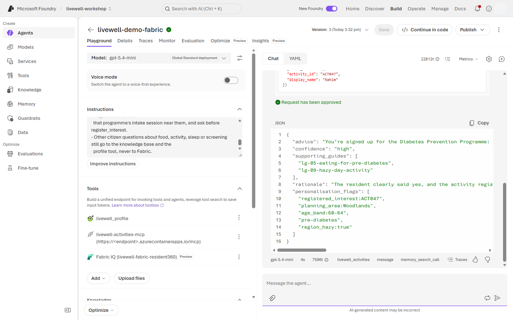

# Lab 3 · Tools, MCP & Memory — hyper-personalisation — portal walkthrough

Main page: [Lab 3](lab-03.md) · [Portal track](PORTAL-TRACK.md)

You will switch the coach to `gpt-4.1-mini`, add a profile OpenAPI tool, an activities MCP tool with approval before registration, memory, and optionally the Fabric IQ tool for programme-level questions.

> The screenshots were taken on the facilitator's demo agent `livewell-demo-tools`. Do every step on your own `livewell-<initials>` agent.

1. Open your guarded agent and switch it to the tools model before adding any tool.

   **Build → Agents → `livewell-<initials>` → Configure → Model `gpt-4.1-mini` → Save**

   

   - `gpt-5-mini` does not support the OpenAPI tool (step 3) or the A2A tools (optional specialists). Switching a coach that has them back to `gpt-5-mini` makes the portal warn that it will remove them.
   - `gpt-4.1-mini` is not a reasoning model, so **Reasoning effort** disappears from **Parameters**. The guardrail, knowledge base and JSON schema stay.

2. Start adding the profile OpenAPI tool.

   **Tools → Add → Add tools → Custom → OpenAPI tool → Create**

   

3. Copy the profile API's description (a block of text called an OpenAPI spec) and paste it into the form. The form has no import-from-URL option.

   1. Leave the form open. Copy the spec below: point at the block and select the **Copy** button in its top-right corner. If there is no button, select all of the text in the block and press **Ctrl+C** (**Cmd+C** on a Mac).

      <!-- openapi-spec:begin (generated by scripts/sync-openapi-block.py sponsor; do not edit) -->
      ```json
      {
        "openapi": "3.0.3",
        "info": {
          "title": "LiveWell resident profile",
          "version": "1.0.0",
          "description": "Synthetic resident_360 extract for the signed-in resident only (LiveWell workshop)."
        },
        "servers": [
          {
            "url": "https://ca-mcp-activities-sponsor.lemonwave-11412166.swedencentral.azurecontainerapps.io"
          }
        ],
        "paths": {
          "/profile/{resident_id}": {
            "get": {
              "operationId": "get_citizen_profile",
              "summary": "Get the signed-in resident's profile",
              "description": "Returns age band, planning area, region, screening risk, conditions, steps, MVPA, sleep, programmes and the region's hazy flag for the resident using the coach. Always pass resident_id = 'me'. Other residents are refused (HTTP 403).",
              "parameters": [
                {
                  "name": "resident_id",
                  "in": "path",
                  "required": true,
                  "description": "Always 'me' (the signed-in resident).",
                  "schema": {
                    "type": "string",
                    "enum": [
                      "me"
                    ]
                  }
                }
              ],
              "responses": {
                "200": {
                  "description": "Profile of the signed-in resident",
                  "content": {
                    "application/json": {
                      "schema": {
                        "type": "object"
                      }
                    }
                  }
                },
                "403": {
                  "description": "Another resident was requested"
                }
              }
            }
          }
        }
      }
      ```
      <!-- openapi-spec:end -->

   2. Go back to the Foundry tab, fill in the form, and select **Create tool**.

   **Name `livewell_profile` → Description → Authentication method `Anonymous` → OpenAPI 3.0+ schema: click the empty box, Ctrl+V → Create tool**

   | Field | What to enter |
   |---|---|
   | **Name** | `livewell_profile`. Use an underscore: the portal rejects dashes and spaces. |
   | **Description** | `Profile of the signed-in resident. Always pass resident_id 'me'.` |
   | **Authentication method** | **Anonymous**, already selected. |
   | **OpenAPI 3.0+ schema** | Click inside the empty box and press **Ctrl+V** (**Cmd+V** on a Mac). The text may show on one line or on many; both are fine. |

   - The pasted text already contains the API's address, so no other field is needed. The screenshot below shows it formatted, with the address hidden.
   - This is a real, read-only REST API that returns only the signed-in resident's profile. Steps 4–6 add the activities as an MCP tool instead, because MCP lets you require approval before a write. See [OpenAPI tool vs MCP tool](lab-03.md#openapi-vs-mcp) and [what is fixed for the workshop](lab-03.md#workshop-shortcuts).

   

4. Start adding the activities MCP tool. The **Configured** tab lists the project's existing tool connections.

   **Tools → Add → Add tools → Configured**

   

5. Select the existing workshop MCP connection and add it.

   **Configured → `livewell-activities-mcp` → Add tool**

   

6. Require approval for the write action.

   **MCP tool row → Actions → Configure → Approval setting → require approval for `register_interest` (keep `find_activities` under "Tools that don't require approval") → Update**

   

7. Enable memory for the agent.

   **Memory (Preview) → Enable memory → Create / select memory store → Save**

   

8. Append the `tools` instruction block from [coach-instructions.md](../prompts/coach-instructions.md) and switch to the evidence schema.

   **Instructions → paste after `safety` block**, then **Parameters (sliders icon next to Model) → Text format: JSON Schema → pencil next to `livewell_answer` → replace with all of [`lab3-evidence.schema.json`](../config/schemas/lab3-evidence.schema.json) → close the panel → Save**

   

9. Note the tools-and-memory version number.

   **Version dropdown (top right, next to Save) → note the newest number → Show all version history**

   

   Versions are numbered, not named. Steps 1, 7 and 8 each saved, so expect the number to have gone up by more than one since Lab 2. Use the newest one.

10. Ask for tailored advice from the profile.

    **Chat → New chat → Message box → Send**

    

    Prompt `lab3_profile_tailored`:

    ```text
    Based on my profile, what is one change I should make this week?
    ```

11. Confirm the profile and knowledge tools in the trace.

    **Response metrics → Traces → tool calls → `get_citizen_profile` and knowledge span**

    

12. Ask for an indoor Woodlands activity and registration in a new chat, so the coach looks up the profile again.

    **Chat → New chat → Message box → Send**

    

    Prompt `lab3_hazy_indoor_signup`:

    ```text
    It's hazy today. What can I do indoors near Woodlands, and can you sign me up?
    ```

    The coach registers interest only after a clear yes. If it lists options and asks which one, reply in the same chat:

    ```text
    Yes, please sign me up for the first indoor option you found.
    ```

13. Approve the registration card once. **Approve** opens a menu: pick **Approve once**. *Always approve this tool* and *Always approve all tools* skip later approvals.

    **Approval card → Approve → Approve once**

    

14. Store a preference in memory.

    **Chat → Message box → Send**

    

    Prompt `lab3_memory_set`:

    ```text
    By the way, I prefer mornings, and I don't like swimming.
    ```

15. Start a new chat and test memory recall.

    **Chat → New chat → Message box → Send**

    

    Prompt `lab3_memory_recall`:

    ```text
    Any activities you would suggest for me next week?
    ```

**Optional: specialist agents (A2A).** Step 11 of the [lab guide](lab-03.md#a2a-specialists). The facilitator has already built and connected the two specialists; you only attach them.

- Attach both specialists, then save.

  **Tools → Add → Add tools → Configured → `livewell-nutrition-a2a` → Add tool**, then the same for **`livewell-activity-a2a`** → **Save**

- Ask for both plans. The reply takes about a minute.

  **Chat → New chat → Message box → Send**

  Prompt `lab3_specialists`:

  ```text
  Can you give me a simple meal plan and an exercise plan for this week that fit my glucose results?
  ```

- Check that both specialists were called.

  **Response metrics → Traces** → one call to `livewell-nutrition-a2a` and one to `livewell-activity-a2a`

16. Optional Fabric step: add the published Fabric IQ data agent from the OneLake Catalog. The catalog takes a few seconds to load; filter by keyword `Resident360`.

    **Tools → Add → Add tools → Configured → Fabric IQ (OneLake Catalog) → Add tool → Resident360 Ontology Agent → Add**

    

17. If the connection already exists, attach it instead of browsing the catalog.

    **Tools → Add → Add tools → Configured → `livewell-fabric-resident360` → Add tool**

    

18. Append the `fabric` instruction block when Fabric IQ is attached.

    **Instructions → paste `fabric` block after `tools` block → Save**

    

19. As Rahim, ask which programme people his age stick with. The coach reads his profile, asks Fabric one
    age-band question, finds the intake session near Woodlands and offers to sign him up. It asks before it calls
    `register_interest`, so the approval card comes after he says yes (step 21).

    **Chat → New chat → Message box → Send**

    

    Prompt `lab3_programme_fit`:

    ```text
    I dropped out of Healthier SG last year. Which programme do people my age actually stick with? Find me a way to start near Woodlands and sign me up.
    ```

20. Check what the coach sent to Fabric. The `userQuestion` argument names the age band and nothing else.

    **Response metrics → Traces → Fabric IQ / MCP call → Input**

    

21. Reply yes, then approve the sign-up for the intake session.

    **Message box → "Yes, please sign me up" → Send → Approval card → Approve → Approve once**

    

22. As Mei, ask the programme-level Fabric question.

    **Chat → New chat → Message box → Send**

    

    Prompt `fabric_q_disengaged_regions`:

    ```text
    Which regions have the highest share of disengaged residents?
    ```

23. Confirm the Fabric IQ call in the trace.

    **Response metrics → Traces → Fabric IQ / MCP call**

    

24. Confirm a citizen knowledge question does not call Fabric.

    **Chat → New chat → Message box → Send**

    

    Prompt `lab1_prediabetes_eat`:

    ```text
    My screening says my glucose is high. What should I eat to manage pre-diabetes?
    ```

## What you should see

Profile advice is tailored to the signed-in synthetic resident and cites guides. Activity registration pauses on an approval card before `register_interest` runs. Memory affects a new chat. With the optional specialists attached, the combined-plan prompt calls both A2A connections and merges their answers into one reply. In the optional Fabric step, Rahim's programme question chains profile → Fabric IQ (age band only) → activities → approval, Mei's aggregate question calls Fabric IQ, and the citizen food question stays on Foundry IQ and profile tools.

## If something looks different

- ⚠️ The OpenAPI form takes a pasted schema, not a URL. Copy the whole spec block from step 3, and keep the tool name `livewell_profile` (dashes are rejected). If **Create tool** reports an invalid schema, you pasted only part of it: copy the block again with its **Copy** button and replace everything in the box.
- ⚠️ **Custom → Model Context Protocol (MCP)** creates a *new* connection. Use it only if `livewell-activities-mcp` is missing from **Configured**: paste the **Activities MCP server** URL from the values sheet as the endpoint and set **Authentication** to **Unauthenticated**.
- ⚠️ Memory is preview and may appear under a different panel; if it is unavailable, complete the tool steps and watch the facilitator memory demo.
- If `livewell-nutrition-a2a` or `livewell-activity-a2a` is missing from **Configured**, the facilitator has not run the specialist setup. Skip the optional specialists; the coach still writes both plans from the knowledge base. An A2A call that fails with 401 or 403 usually means the project's Foundry Agent Consumer role has not applied yet (up to 10 minutes).
- ⚠️ Fabric IQ is preview; if OneLake Catalog browsing is unavailable, use `livewell-fabric-resident360` or the facilitator's prepared agent.
- If registration runs without approval, stop using that chat and reconfigure approval for `register_interest`.

