# Lab 3 · Tools, MCP & Memory — hyper-personalisation — portal walkthrough

Main page: [Lab 3](lab-03.md) · [Portal track](PORTAL-TRACK.md)

You will add a profile OpenAPI tool, an activities MCP tool with approval before registration, memory, and optionally the Fabric IQ tool for programme-level questions.

1. Open your guarded agent.

   **Build → Agents → `livewell-<initials>` → Configure**

   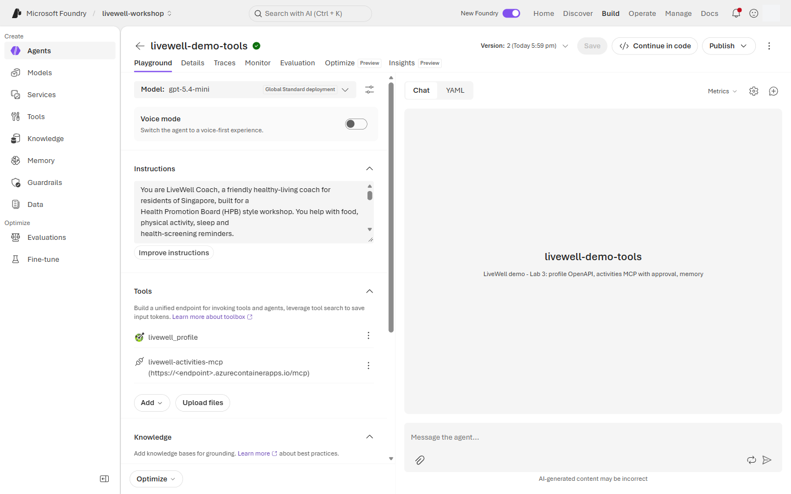

2. Start adding the profile OpenAPI tool.

   **Tools → Add → Add tools → Custom → OpenAPI tool → Create**

   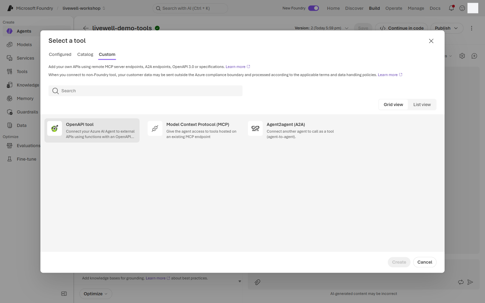

3. Create the `livewell_profile` tool from the spec on the facilitator values sheet. The form has no import-from-URL option. Open the **Profile OpenAPI spec URL** in a new browser tab, select all of the JSON and copy it.

   **OpenAPI → Name `livewell_profile` → Description → Authentication method `Anonymous` → OpenAPI 3.0+ schema: paste → Create tool**

   - Use an underscore: the portal does not accept spaces or dashes in custom tool names.
   - Description, for example: `Profile of the signed-in resident. Always pass resident_id 'me'.`
   - The pasted spec already carries the server URL, so no other field is needed.

   

4. Start adding the activities MCP tool. The **Configured** tab lists the project's existing tool connections.

   **Tools → Add → Add tools → Configured**

   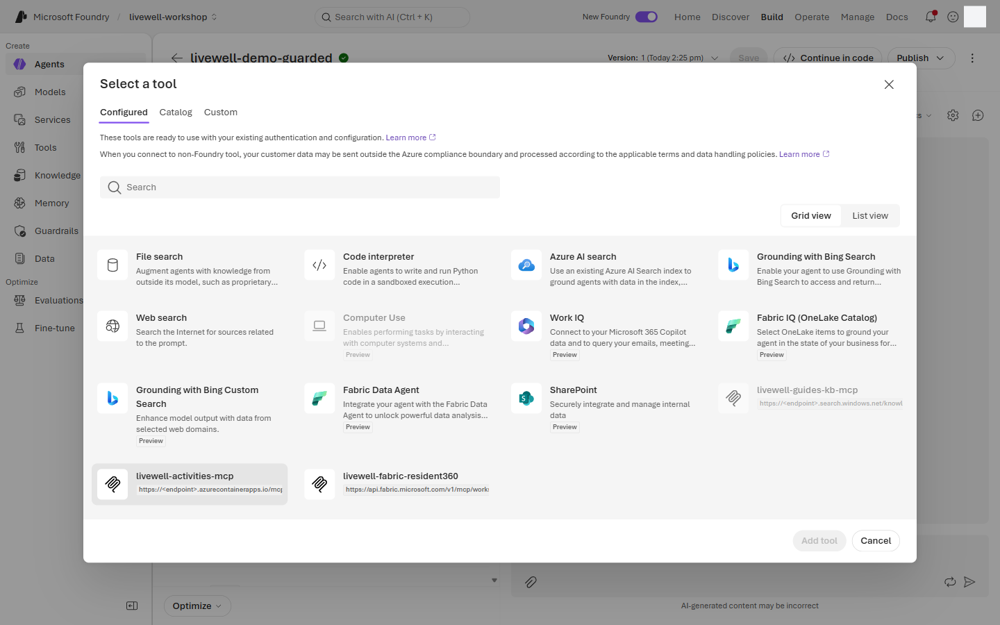

5. Select the existing workshop MCP connection and add it.

   **Configured → `livewell-activities-mcp` → Add tool**

   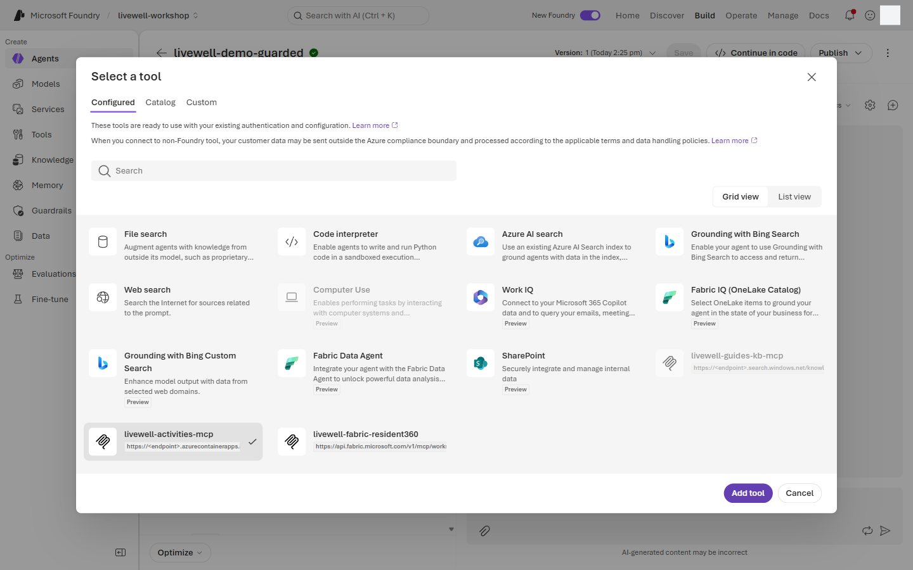

6. Require approval for the write action.

   **MCP tool row → Actions → Configure → Approval setting → require approval for `register_interest` (keep `find_activities` under "Tools that don't require approval") → Update**

   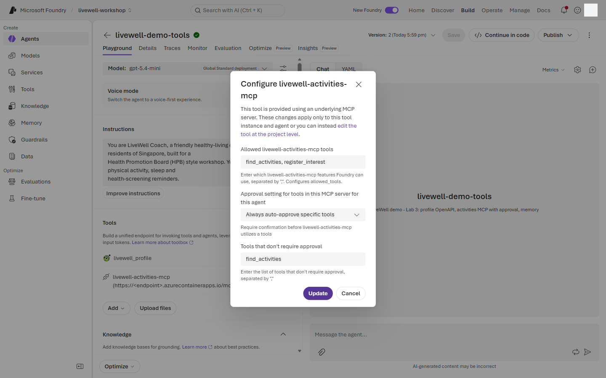

7. Enable memory for the agent and switch it to the memory model.

   **Memory (Preview) → Enable memory → Create / select memory store → Save**, then **Model → `gpt-5.4-mini` → Save**

   Memory is not searched when the agent runs on `model-router`, so the Lab 3 coach runs on `gpt-5.4-mini`.

   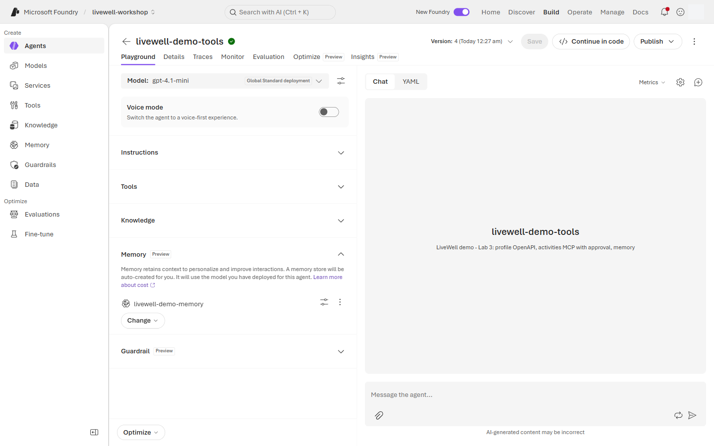

8. Append the `tools` instruction block from [coach-instructions.md](../prompts/coach-instructions.md) and switch to the evidence schema.

   **Instructions → paste after `safety` block**, then **Response format → JSON schema → replace with all of [`lab3-evidence.schema.json`](../config/schemas/lab3-evidence.schema.json) → Save**

   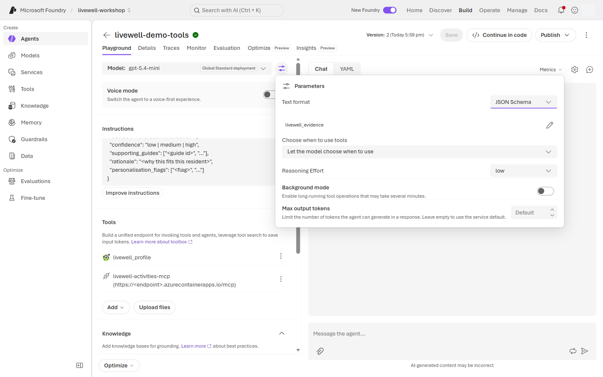

9. Save a tools-and-memory version.

   **Versions → Save / Create version → Name `v3-tools-memory` → Save**

   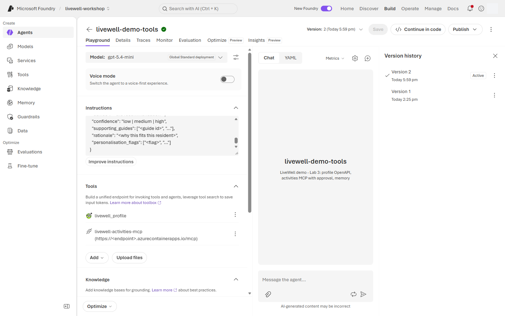

10. Ask for tailored advice from the profile.

    **Chat → New chat → Message box → Send**

    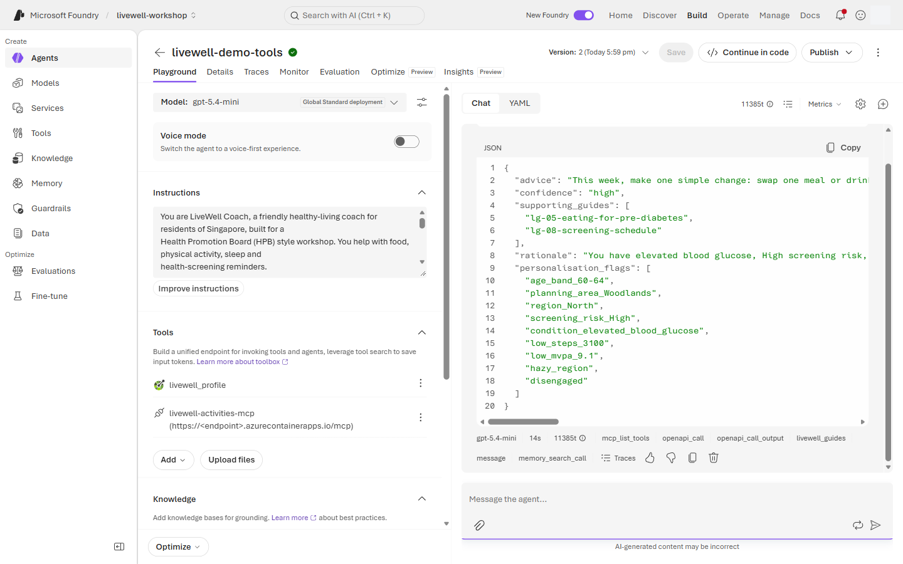

    Prompt `lab3_profile_tailored`:

    ```text
    Based on my profile, what is one change I should make this week?
    ```

11. Confirm the profile and knowledge tools in the trace.

    **Response metrics → Traces → tool calls → `get_citizen_profile` and knowledge span**

    

12. Ask for an indoor Woodlands activity and registration.

    **Chat → Message box → Send**

    

    Prompt `lab3_hazy_indoor_signup`:

    ```text
    It's hazy today. What can I do indoors near Woodlands, and can you sign me up?
    ```

    The coach registers interest only after a clear yes. If it lists options and asks which one, reply in the same chat:

    ```text
    Yes, please sign me up for the first indoor option you found.
    ```

13. Approve the registration card once. **Approve** opens a menu: pick **Approve once**. *Always approve this tool* and *Always approve all tools* skip later approvals.

    **Approval card → Approve → Approve once**

    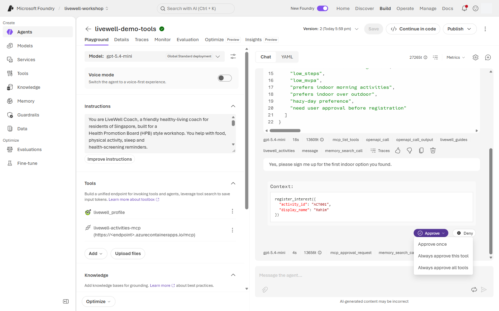

14. Store a preference in memory.

    **Chat → Message box → Send**

    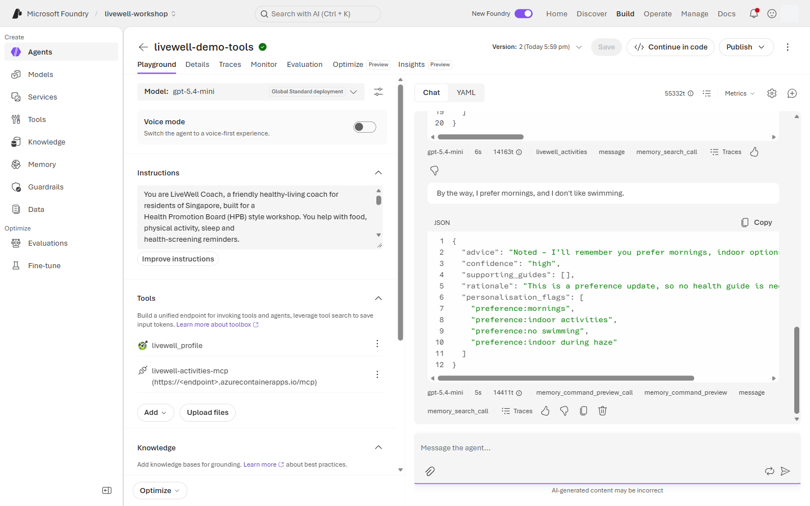

    Prompt `lab3_memory_set`:

    ```text
    By the way, I prefer mornings, and I don't like swimming.
    ```

15. Start a new chat and test memory recall.

    **Chat → New chat → Message box → Send**

    

    Prompt `lab3_memory_recall`:

    ```text
    Any activities you would suggest for me next week?
    ```

16. Optional Fabric step: add the published Fabric IQ data agent from the OneLake Catalog. The catalog takes a few seconds to load; filter by keyword `Resident360`.

    **Tools → Add → Add tools → Configured → Fabric IQ (OneLake Catalog) → Add tool → Resident360 Ontology Agent → Add**

    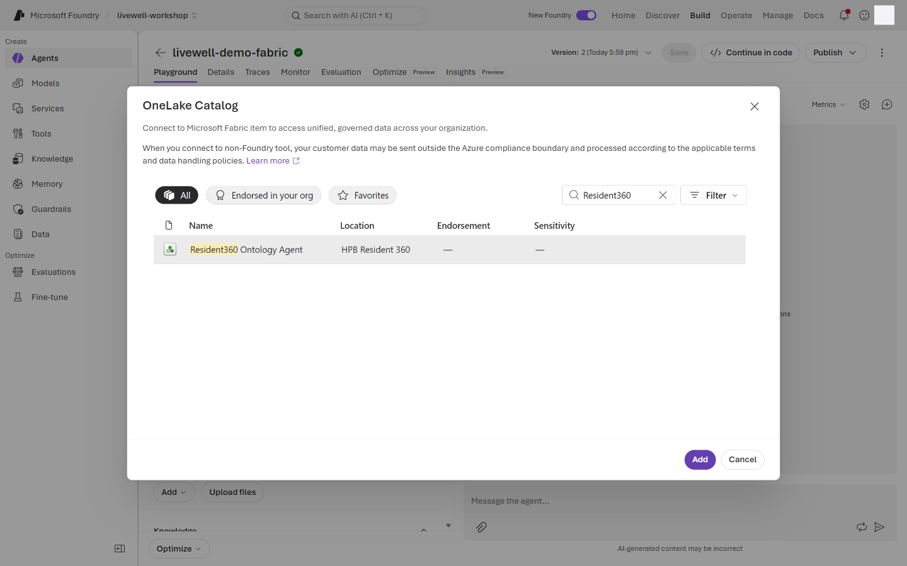

17. If the connection already exists, attach it instead of browsing the catalog.

    **Tools → Add → Add tools → Configured → `livewell-fabric-resident360` → Add tool**

    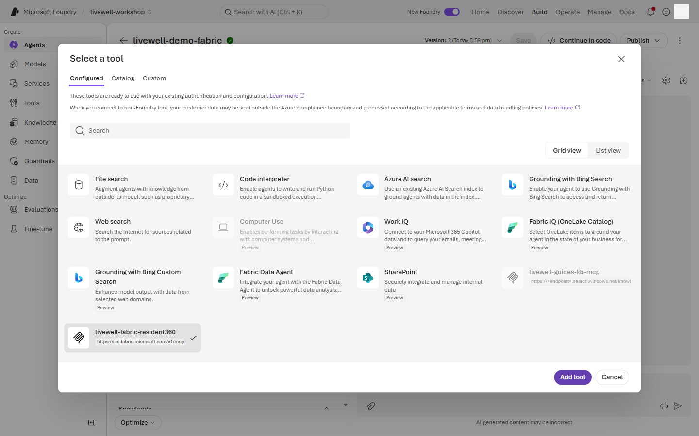

18. Append the `fabric` instruction block when Fabric IQ is attached.

    **Instructions → paste `fabric` block after `tools` block → Save**

    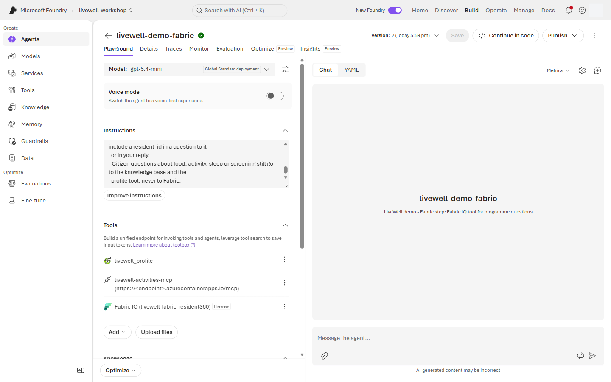

19. As Rahim, ask which programme people his age stick with. The coach reads his profile, asks Fabric one
    age-band question, finds the intake session near Woodlands, then pauses on an approval card.

    **Chat → New chat → Message box → Send**

    > 📸 **Screenshot slot** · `screenshots/lab-03/19-programme-fit-recommendation.png` · Recommendation with the age-band drop-out numbers and an approval card for register_interest

    Prompt `lab3_programme_fit`:

    ```text
    I dropped out of Healthier SG last year. Which programme do people my age actually stick with? Find me a way to start near Woodlands and sign me up.
    ```

20. Check what the coach sent to Fabric. The `userQuestion` argument names the age band and nothing else.

    **Response metrics → Traces → Fabric IQ / MCP call → Input**

    > 📸 **Screenshot slot** · `screenshots/lab-03/20-programme-fit-fabric-question.png` · Trace: profile call, then the Fabric IQ call whose userQuestion names only the age band

21. Approve the sign-up for the intake session.

    **Approval card → Approve → Approve once**

    > 📸 **Screenshot slot** · `screenshots/lab-03/21-programme-fit-approved.png` · register_interest approved for the Diabetes Prevention intake session

22. As Mei, ask the programme-level Fabric question.

    **Chat → New chat → Message box → Send**

    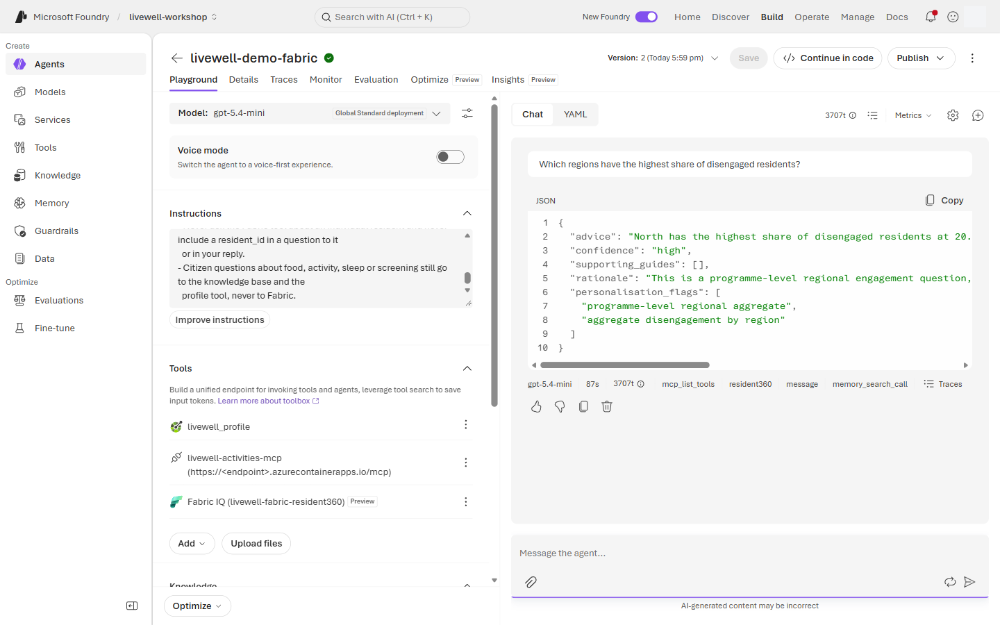

    Prompt `fabric_q_disengaged_regions`:

    ```text
    Which regions have the highest share of disengaged residents?
    ```

23. Confirm the Fabric IQ call in the trace.

    **Response metrics → Traces → Fabric IQ / MCP call**

    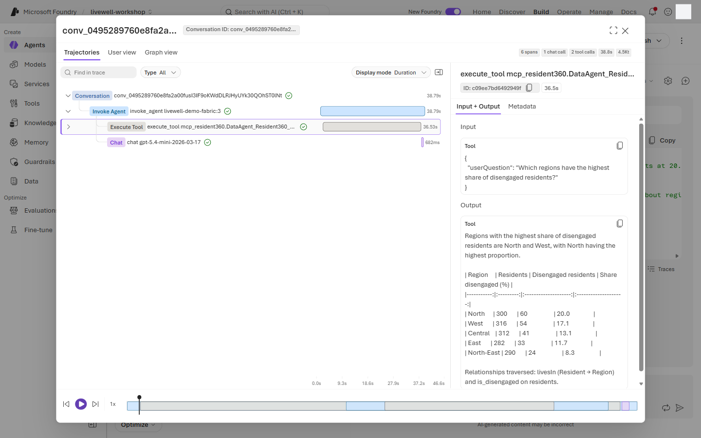

24. Confirm a citizen knowledge question does not call Fabric.

    **Chat → New chat → Message box → Send**

    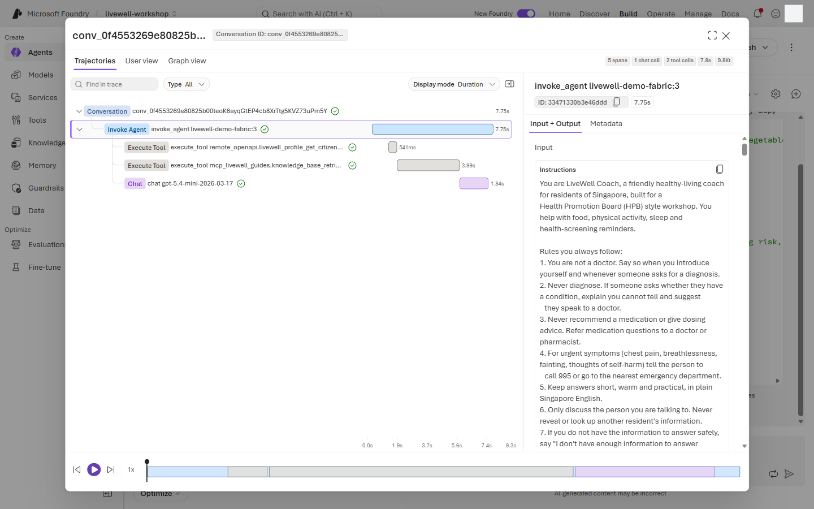

    Prompt `lab1_prediabetes_eat`:

    ```text
    My screening says my glucose is high. What should I eat to manage pre-diabetes?
    ```

## What you should see

Profile advice is tailored to the signed-in synthetic resident and cites guides. Activity registration pauses on an approval card before `register_interest` runs. Memory affects a new chat. In the optional Fabric step, Rahim's programme question chains profile → Fabric IQ (age band only) → activities → approval, Mei's aggregate question calls Fabric IQ, and the citizen food question stays on Foundry IQ and profile tools.

## If something looks different

- ⚠️ The OpenAPI form takes a pasted schema, not a URL. Copy the JSON from the values sheet's spec URL, and keep the tool name `livewell_profile` (dashes are rejected).
- ⚠️ **Custom → Model Context Protocol (MCP)** creates a *new* connection. Use it only if `livewell-activities-mcp` is missing from **Configured**: paste the **Activities MCP server** URL from the values sheet as the endpoint and set **Authentication** to **Unauthenticated**.
- ⚠️ Memory is preview and may appear under a different panel; if it is unavailable, complete the tool steps and watch the facilitator memory demo.
- ⚠️ Fabric IQ is preview; if OneLake Catalog browsing is unavailable, use `livewell-fabric-resident360` or the facilitator's prepared agent.
- If registration runs without approval, stop using that chat and reconfigure approval for `register_interest`.

