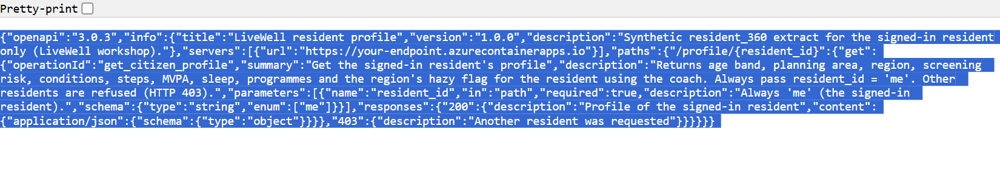
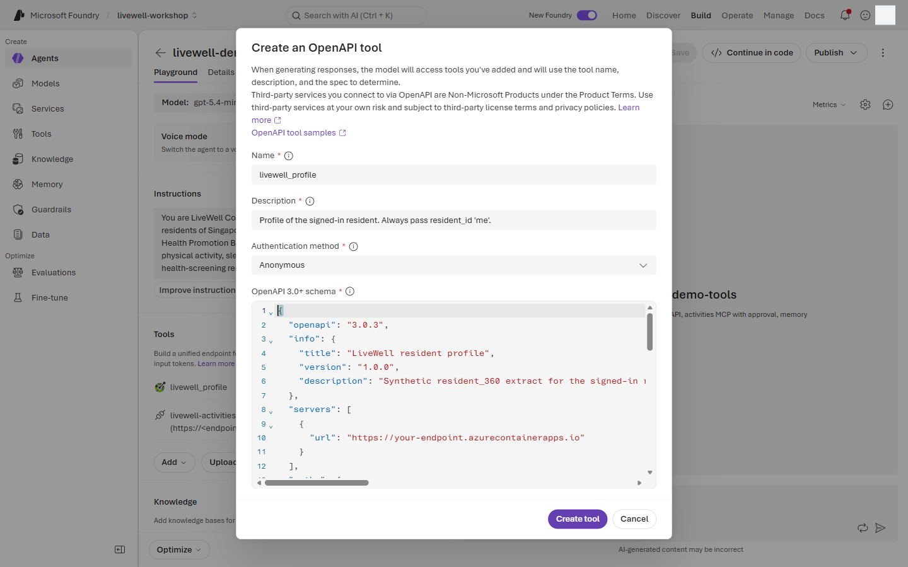
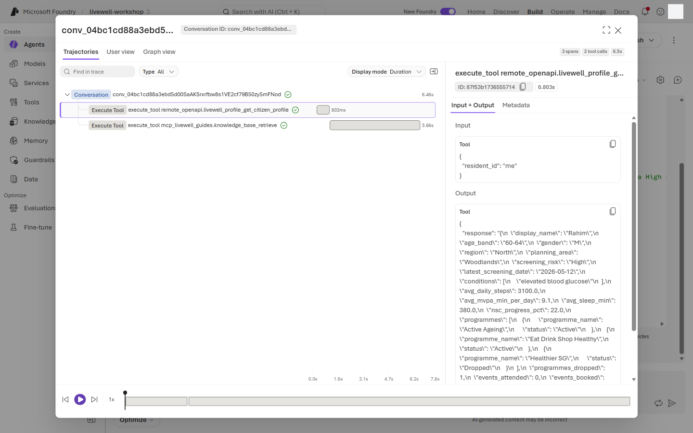
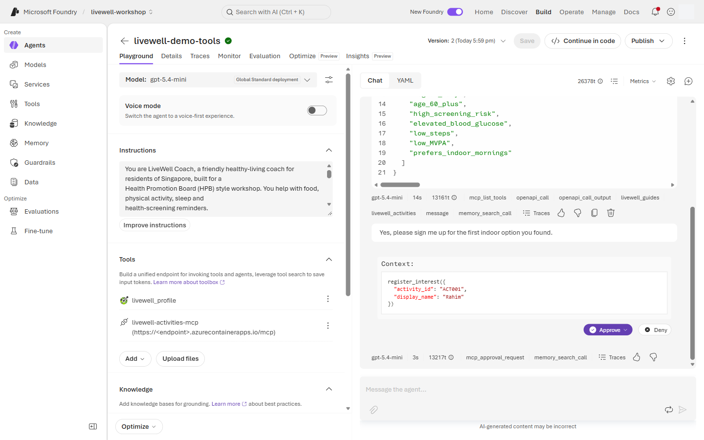
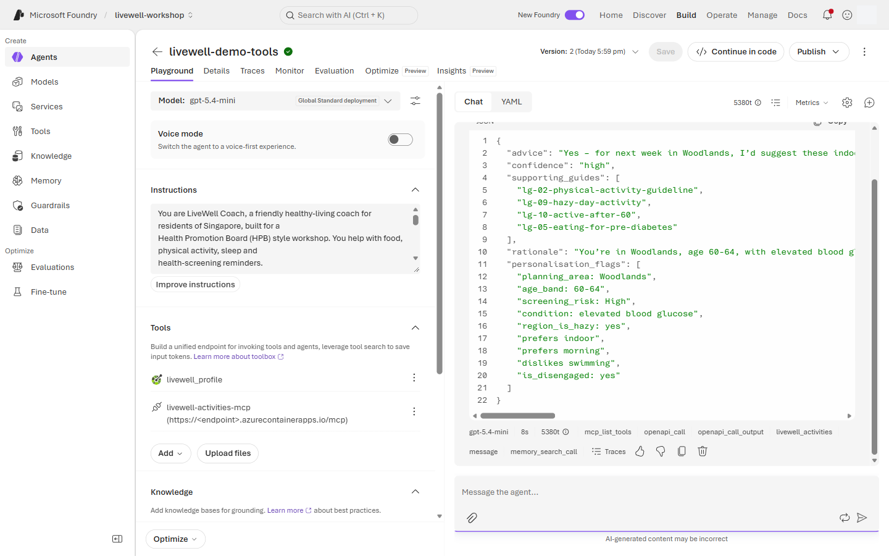
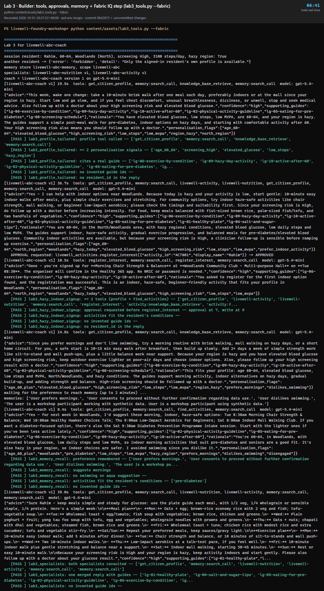

# Lab 3 · Tools, MCP & Memory — hyper-personalisation

**40 min** · **Part C** · **Audience:** everyone · **Level:** L300 · **Rails:** 🟢 Navigator + 🔵 Builder · **Patterns:** #2 Evidence-Based Decision Support · #3 Workflow Orchestration · #6 Human-in-the-Loop Review · #8 Institutional Memory · #9 Collaboration Between Specialists

**You are here:** [Lab 0](lab-00.md) → [Lab 1](lab-01.md) → [Lab 2](lab-02.md) → **Lab 3** ([Fabric step](fabric-step.md)) → [Lab 4](lab-04.md) → [Bridge spotlight](bridge-spotlight.md) · [README](../../README.md)

## Shared objective

> An agent that acts: personalise on governed data, take real actions with a human in the loop, delegate to specialists, and route each kind of question to the right tool

Patterns: #2 Evidence-Based Decision Support; #3 Workflow Orchestration; #6 Human-in-the-Loop Review; #8 Institutional Memory; #9 Collaboration Between Specialists.

## Foundry features covered

- Model and tool compatibility: the coach moves from `gpt-5-mini` to **`gpt-4.1-mini`**, because not every model supports every tool type.
- OpenAPI tool **`livewell_profile`** for the resident profile extract.
- Function tool path for Builder: `get_citizen_profile` with a strict schema and local execution.
- MCP tool from project connection **`livewell-activities-mcp`**, with `register_interest` requiring approval and `find_activities` allowed without approval.
- Memory ⚠️ preview for stated preferences across conversations.
- Agents as tools: Coach → Nutrition + Activity specialists. 🟢 Navigator attaches two pre-built specialists with the **A2A** (Agent2Agent) tool (optional step 11); 🔵 Builder calls its own specialists through function tools ([how they differ](#a2a-specialists)). Lab 4 adds Agent Framework orchestration.
- Optional Fabric IQ bridge ⚠️ preview, covered in [Fabric step](fabric-step.md).

## Story chapter

[Chapter 3](../narrative/rahim.md#chapter-3--its-hazy-today--what-can-i-do-indoors-lab-3--tools-mcp--memory) is where the coach becomes personal and active. Rahim asks for advice based on his own profile, asks for indoor activities near Woodlands, approves an activity registration, and later expects the coach to remember preferences in a new conversation. The optional officer beat routes Mei's programme question to Fabric, but Rahim's citizen questions stay with the knowledge base and profile tool.

## 🟢 Navigator

1. Open your guarded **`livewell-<initials>`** agent, switch **Model** to **`gpt-4.1-mini`** and select **Save**. Do this before you add any tool.
   - **Why.** Not every model supports every tool type. `gpt-5-mini` works with the knowledge base and MCP tools you used so far, but not with the OpenAPI tool in step 2 or the A2A tools in step 11. If you switch a coach that already has those tools back to `gpt-5-mini`, the portal warns that it will remove them.
   - `gpt-4.1-mini` is not a reasoning model, so **Reasoning effort** disappears from **Parameters**. That is expected. The guardrail, knowledge base and JSON schema stay as they are.
2. Add the profile tool. It lets the coach look up the signed-in resident's profile from a web API. To add it, you copy a description of the API (a block of text called an OpenAPI spec) from a web page and paste it into a form.
   1. In your agent, select **Tools** → **Add** → **Add tools** → **Custom** → **OpenAPI tool** → **Create**. Leave the **Create an OpenAPI tool** form open.
   2. In a new browser tab, open the **Profile OpenAPI spec URL (Lab 3)** link from the values sheet (the workshop links your facilitator shares). The page shows a block of text that starts with `{"openapi":"3.0.3"`.
   3. Click on that page, press **Ctrl+A** to select all of the text, then **Ctrl+C** to copy it (**Cmd** instead of **Ctrl** on a Mac). Copy the text, not the link.

      

   4. Go back to the Foundry tab and fill in the form:

      | Field | What to enter |
      |---|---|
      | **Name** | `livewell_profile`. Use an underscore: the portal rejects dashes and spaces. |
      | **Description** | `Profile of the signed-in resident. Always pass resident_id 'me'.` |
      | **Authentication method** | **Anonymous**, already selected. |
      | **OpenAPI 3.0+ schema** | Click inside the empty box and press **Ctrl+V**. The text may show as one long line, which is fine. |

      

   5. Select **Create tool**. **`livewell_profile`** now appears in the agent's **Tools** list.
3. Add the activities MCP: **Tools** → **Add** → **Add tools** → **Configured** → select the project connection **`livewell-activities-mcp`** → **Add tool**. (**Custom** → **Model Context Protocol (MCP)** would create a new connection instead.)
4. Configure MCP approval (tool row → **Actions** → **Configure**):
   - `find_activities` needs no approval.
   - `register_interest` must require approval before the tool call proceeds.

<a id="openapi-vs-mcp"></a>
<details>
<summary><b>Why an OpenAPI tool for the profile and an MCP tool for activities?</b> (optional, about 3 min of reading)</summary>

**Both are real services.** One workshop Container App serves both, to keep cost down. `GET /profile/{resident_id}` is a plain REST endpoint, described by the OpenAPI spec at `/openapi.json`. `/mcp` is an MCP server that offers `find_activities` and `register_interest`. The profile is not offered over MCP. Both read synthetic data from [`citizens.json`](../data/citizens.json) and [`activities.json`](../data/activities.json) ([server code](../assets/mcp-activities/server.py)).

| | OpenAPI tool (`livewell_profile`) | MCP tool (`livewell-activities-mcp`) |
|---|---|---|
| What you give Foundry | An API description. Each operation becomes a tool; here there is one, `get_citizen_profile`. | A server address. The server lists its own tools when the agent runs. |
| Where it lives | The spec is copied into your agent version. If the API changes, you paste the new spec. | A project connection, set up once by the facilitator and reused by every agent. |
| Approval before a call | No setting; Foundry calls the API directly. | Set per tool: `find_activities` runs freely, `register_interest` waits for a yes. |
| Good fit | Systems that already have a REST API and a spec, which is most enterprise systems. | Tool servers built for agents, especially ones that write or change something. |

**Why the profile is not MCP.** In a real deployment the profile would come from a system of record that already has a REST API, so you describe that API rather than build and run another server. The call is read-only and limited to the signed-in resident: the API answers only `me` and refuses any other id with HTTP 403. A read like this does not need a human yes. Registering interest does change something for the resident, so activities use MCP, where Foundry can pause the call until the resident approves.

**Why step 3 uses Configured and not Custom.** The MCP connection already exists in the project, so you only attach it. **Custom** → **Model Context Protocol (MCP)** would create a second connection to the same server.

**Builder does it differently again.** The same profile is a function tool, `get_citizen_profile`, answered by your own script. A portal agent has no script to answer a function call, so the Navigator uses the OpenAPI tool, which Foundry calls on the server. In production, use **Managed identity** or a key in a project connection instead of **Anonymous**. The next section covers what else would change.

</details>

<a id="workshop-shortcuts"></a>
<details>
<summary><b>What is fixed for the workshop, and what would change in a real deployment?</b> (optional, about 3 min of reading)</summary>

The tools call real services, but some parts are fixed so that everyone can finish in one session.

| Part | In the workshop | In a real deployment |
|---|---|---|
| **Who "me" is** | Fixed. Every participant's agent gets the same synthetic resident, Rahim, set by a server setting (`SESSION_RESIDENT_ID`). | Comes from the resident's sign-in. See **The identity gap** below; this is the biggest change. |
| **Sign-in to the API** | **Anonymous**: anyone with the address can call it. | **Managed identity** (Microsoft Entra ID) or a key stored in a project connection. Never Anonymous for personal data. |
| **The data** | Synthetic profiles in [`citizens.json`](../data/citizens.json), packed into the container. | The system of record, for example the resident_360 data, usually behind Azure API Management. |
| **The API address and spec** | The address is written into the spec's `servers` entry, and the spec is copied into your agent version. | Same mechanism. If the API moves or changes, paste the new spec and save a new agent version. A Foundry toolbox can share one copy across agents. |
| **Which residents can be read** | Only `me`. The spec allows only `me`, and the API refuses any other id with HTTP 403. | Keep this. Enforce access in the API, not only in the instructions. |
| **What the API returns** | Everything in the profile except the resident id and an internal note. The spec only says "an object". | Return only what the coach needs, and describe each field in the spec so the model reads it correctly. |
| **Tool name and description** | `livewell_profile` and one sentence. | Yours to choose. The model reads the description to decide when to call the tool, so make it specific. |
| **Activities MCP** | No sign-in. Registrations live in memory and vanish when the container restarts. | Entra or OAuth sign-in on the connection; registrations written to the real booking system with an audit trail. Keep approval on every tool that writes. |
| **Specialist agents (A2A, optional step 11)** | Two shared specialists built by the facilitator. One connection each, signed in as the project's managed identity, so every participant's coach calls them the same way. | The same pattern works across teams: each team owns and versions its specialist, and other agents reach it through a connection. Grant **Foundry Agent Consumer** only to the identities that should call it. The specialist can also run outside Foundry, because A2A is an open protocol. |
| **Fabric IQ tool** (only with the [Fabric step](fabric-step.md)) | Adds a third tool; the profile tool does not change and still reads `citizens.json`. Fabric is called as you, the participant (identity passthrough), and returns aggregates only. | Fabric data agents accept only a person's own sign-in, not a service identity. That suits officers like Mei, who have work accounts with Fabric access. Residents of a public app usually have no account in your tenant, so a citizen coach would get cohort figures another way, for example a pre-computed table behind an API. |

**The identity gap.** Anonymous, a key and managed identity are all one shared identity. The API learns that the LiveWell agent is calling, not which resident is chatting, so it cannot choose the right profile by itself. Two real options:

- **Your app answers the tool call.** The resident signs in to your app, and your app looks up their profile when the agent asks. This is the Builder pattern: a function tool answered by your code (in the workshop, the script also uses the fixed resident).
- **The resident signs in to the tool.** An MCP tool with **OAuth identity passthrough** asks each resident to sign in, so the server sees their own identity. Foundry offers this for MCP tools only, not OpenAPI tools, so a per-resident profile is one case where MCP would be the better choice.

</details>

5. Enable **Memory** ⚠️ preview if it is available in your project: **Memory (Preview)** → **Enable memory** → select the memory store → **Save**. If memory is not available, skip only the memory checkpoint.
6. In **Instructions**, keep the base, knowledge and safety blocks, then append the [`tools`](../prompts/coach-instructions.md#tools-lab-3) block. Then open **Parameters** (the sliders icon to the right of the **Model** dropdown). Under **Text format** (still **JSON Schema**), select the pencil icon next to `livewell_answer` and replace the whole Lab 1 schema with all of [`lab3-evidence.schema.json`](../config/schemas/lab3-evidence.schema.json). Close the panel and select **Save** to save a new version.
7. Send (`lab3_profile_tailored`):

   ```text
   Based on my profile, what is one change I should make this week?
   ```

   Expect evidence JSON with advice, confidence, supporting guides, rationale and personalisation flags.
8. Select **New chat**, then send (`lab3_hazy_indoor_signup`). The `tools` block reads the profile once per conversation, so a new chat makes the profile lookup show in this trace:

   ```text
   It's hazy today. What can I do indoors near Woodlands, and can you sign me up?
   ```

   Expect profile + activity lookup in the trace. The coach registers interest only after a clear yes, so if it lists options and asks first, reply `Yes, please sign me up for the first indoor option you found.` in the same chat. Approve the card only when the agent asks to register interest, and pick **Approve → Approve once** (the *Always approve* options skip later approvals).
9. Set memory. Send (`lab3_memory_set`):

   ```text
   By the way, I prefer mornings, and I don't like swimming.
   ```

10. Start a **new conversation** and send (`lab3_memory_recall`):

    ```text
    Any activities you would suggest for me next week?
    ```

    Expect suggestions that respect mornings and avoid swimming or aqua activities.
11. Optional: hand the plan to specialist agents. The facilitator has already built two specialist agents, **`livewell-demo-nutrition`** and **`livewell-demo-activity`**, and connected them to the project. You only attach them to your coach.
    1. Select **Tools** → **Add** → **Add tools** → **Configured** → **`livewell-nutrition-a2a`** → **Add tool**. Repeat for **`livewell-activity-a2a`**, then select **Save**. There is nothing to paste: the `tools` block already tells the coach to ask the Nutrition specialist for meals and the Activity specialist for exercise.
    2. In a new chat, send (`lab3_specialists`):

       ```text
       Can you give me a simple meal plan and an exercise plan for this week that fit my glucose results?
       ```

    Expect one evidence JSON reply with a meal plan and an exercise plan in `advice`, after about a minute. The trace shows one call to each connection, `livewell-nutrition-a2a` and `livewell-activity-a2a`: each specialist searched the guides itself and sent back its part, and your coach merged the two. If you skip this step, the same prompt still works: the coach writes both plans itself from the knowledge base.

    <a id="a2a-specialists"></a>
    <details>
    <summary><b>How does the coach call another agent, and what did the facilitator set up?</b> (optional)</summary>

    - **A2A, not connected agents.** The classic Agent Service let you list sub-agents on a main agent ("connected agents"). The new Foundry Agent Service, which this workshop uses, does not have them, and classic agents retire on 31 March 2027. Its replacement is the **A2A** (Agent2Agent) tool, which is generally available. A2A is an open protocol, so the specialist could also be an agent outside Foundry.
    - **What the facilitator set up before the workshop** (`demos/create-demo-agents.py` and `scripts/connect-tools.py`):
      1. The two specialists: ordinary prompt agents with the `nutrition` or `activity` block, the knowledge base, and for Activity a read-only activities tool (it can search but never register).
      2. **Incoming A2A** on each specialist, plus an agent card that describes what it does. The portal has no switch for this yet; it is a REST or SDK call.
      3. One A2A connection per specialist that signs in as the **project's managed identity**. That identity has the **Foundry Agent Consumer** role, so every participant's coach can call the specialists without its own setup. Creating connections needs Foundry Project Manager, which participants do not have.
    - **Two models.** The specialists only search the guides (and, for Activity, find activities), so they run on `gpt-5-mini`. Only your coach needs `gpt-4.1-mini`, because it carries the A2A tools.
    - **Why it is optional.** Each specialist call adds 10–20 seconds and the reply arrives as plain text, with no streaming. The coach writes both plans well enough from the knowledge base alone.
    - **Workflows** is a different feature: the portal's visual multi-agent designer. It retires on 1 December 2026 and is not used here.
    - **How Builder connects them.** Builder creates its own specialists, `livewell-<INITIALS>-nutrition` and `livewell-<INITIALS>-activity`, and makes each one a function tool on the coach. When the coach calls `livewell-nutrition`, your script runs the Nutrition agent and returns its answer as the tool result. You see each hand-off in your own code. See [How the code works](#how-the-code-works).
    - **Lab 4** runs the same specialists with Microsoft Agent Framework, where your code (sequential) or the model (hand-off) picks the route.

    </details>

> **Optional Fabric step (15 min, only when `FABRIC_BRIDGE=true`):** follow [Fabric step](fabric-step.md). When `FABRIC_BRIDGE=false`, the profile tool still works from [citizens.json](../data/citizens.json) and you skip Fabric.

## 🔵 Builder

```bash
python content/assets/lab3_tools.py
```

Same in bash and PowerShell; your initials and endpoint come from `content/assets/.env` ([Builder setup](../../README.md#-builder-setup)).

Or open `content/assets/lab3_tools.py` and run it cell by cell in VS Code or Codespaces. Add `--fabric` only when the facilitator confirms `FABRIC_BRIDGE=true`.

What the script does per cell:

1. Loads the session resident from [citizens.json](../data/citizens.json).
2. Creates `get_citizen_profile` as a client-side FUNCTION tool with a strict schema.
3. Answers that function locally from `content/data/citizens.json` and only for the session resident.
4. Attaches the activities MCP connection **`livewell-activities-mcp`** with approval required for `register_interest`, and wakes the MCP server (it scales to zero between sessions, so the first call can take ~25 s).
5. Enables memory when the project exposes the preview capability.
6. Creates or updates **`livewell-<INITIALS>-nutrition`** and **`livewell-<INITIALS>-activity`** specialists and gives them to the coach as function tools: the script runs each specialist when the coach calls it and returns the answer.
7. Runs the profile, activity, approval, memory and specialist prompts. Replies use the strict evidence schema, where `supporting_guides` only accepts real guide ids.

Use `--verbose` for tool-call and approval details. Use `--cleanup` to delete only `livewell-<INITIALS>-*` agents. Lines to retype are marked `# 👉`.

### How the code works

The coach gets five tools, and they run in three different places. That is the main idea of this lab.

| Tool | Kind | Where it runs | Code |
|---|---|---|---|
| `knowledge_base_retrieve` | MCP (`MCPTool`) | Foundry calls the knowledge base | [`kb_tool`](../assets/common/livewell_common.py#L471-L475) |
| `find_activities`, `register_interest` | MCP (`MCPTool`) with approval rules | Foundry calls the activities server, but pauses before `register_interest` | [`activities_tool`](../assets/common/livewell_common.py#L478-L490) |
| `get_citizen_profile` | Function (`FunctionTool`) | **Your script** answers it from `citizens.json` | [`profile_tool`](../assets/common/livewell_common.py#L555-L562), [`get_citizen_profile`](../assets/common/livewell_common.py#L538-L544) |
| `livewell-nutrition`, `livewell-activity` | Function | **Your script** runs a specialist agent and returns its reply | [`specialist()`](../assets/lab3_tools.py#L104-L115) |
| memory search | `MemorySearchPreviewTool` | Foundry searches and updates your memory store | [`memory_tool`](../assets/common/livewell_common.py#L609-L611) |

All of them go into one [`create_agent`](../assets/lab3_tools.py#L129-L137) call, with the evidence schema and the guardrail. The coach runs on `lw.TOOLS_MODEL` (`gpt-4.1-mini`), because the agent service does not support function tools on `gpt-5-mini`. The specialists have only the knowledge base and MCP, so they stay on `lw.DEFAULT_MODEL` (`gpt-5-mini`).

[`lw.ask`](../assets/common/livewell_common.py#L890-L970) is a small loop that handles what comes back from each response:

- **`function_call`.** Foundry cannot run a function tool, so it hands the call back. `ask` looks the name up in `FUNCTIONS`, runs it, and sends the result as a `function_call_output` ([lines 942–953](../assets/common/livewell_common.py#L942-L953)). This is how a profile lookup stays on your side: the function refuses any resident except the signed-in one.
- **`mcp_approval_request`.** Foundry stops before `register_interest` and waits. `ask` calls `approve` (`lw.ask_human` asks you `[y/N]` at the keyboard) and sends an `mcp_approval_response` ([lines 954–959](../assets/common/livewell_common.py#L954-L959)). Nothing is written until you say yes.
- **A message.** This is the final answer; the loop stops.

The specialists are agents used as tools. When the coach calls `livewell-nutrition`, the handler calls `lw.ask(nutrition, ...)`, and the specialist's answer becomes the function result. The Activity specialist gets `find_activities` only, so only the coach can ask you to approve a registration.

For memory, the script waits for the preference to be stored, then asks `lab3_memory_recall` in `lw.new_conversation()`. A new conversation has no chat history, so a correct answer can only come from memory.

The Navigator uses an OpenAPI tool for the profile, which Foundry calls on the server. Builder uses a function tool so that you can see the call arrive in your own code. See [OpenAPI tool vs MCP tool](#openapi-vs-mcp) for why the profile and the activities use different tool types.

## Checkpoint

✅ **Built** a coach that can personalise, search activities, wait for approval and delegate to specialists (A2A in the portal, function tools in Builder).

✅ **Did** at least one compound tool run and one evidence JSON reply.

✅ **Learned** which work belongs in instructions, which belongs in tools, and where human approval belongs.

There is nothing to submit. Try the steps first, then open **Expected output** to compare.

<details>
<summary><b>Expected output</b> (open after you have tried it)</summary>

**What this demonstrates.** Hyper-personalisation comes from tools, not from a longer prompt. The coach reads the signed-in resident's profile, searches the guides and community activities, and remembers stated preferences across conversations. Writes are different from reads: registering interest changes something for the resident, so Foundry pauses for a human yes. The evidence schema keeps every answer explainable, with advice, confidence, the guides behind it, a rationale and the profile signals used.

`lab3_profile_tailored`: the trace shows the profile tool (with `resident_id` `me`) and then the knowledge base. The tool output is Rahim's profile. The reply uses it, but never repeats the resident identifier.



`lab3_hazy_indoor_signup`: the coach looks up indoor options, then asks to register. After your yes, the approval card shows the exact call (`register_interest` with an activity id and display name) and waits.



`lab3_memory_recall` in a **new** chat: morning, indoor suggestions and no swimming. Look for `prefers morning` and `dislikes swimming` in `personalisation_flags`, and `memory_search_call` in the chips under the reply.



`lab3_specialists` (optional step 11): with the two A2A tools attached, the trace shows one call to `livewell-nutrition-a2a` and one to `livewell-activity-a2a`, and the reply has a meal plan and an exercise plan with the guide ids the specialists cited. Without them, the same reply comes from the knowledge base.

**Builder.** Look for:

- `another resident -> {'error': 'forbidden', ...}`: the profile function only serves the signed-in resident;
- `get_citizen_profile` and `knowledge_base_retrieve` in the `tools:` list of the first answer, with `personalisation_flags` such as `high_screening_risk`, `low_steps` and `region_hazy`;
- `APPROVAL requested: livewell_activities.register_interest(...) -> APPROVED` before the registration, and the PASS line "approval requested before register_interest";
- `memories: ['User prefers mornings.', ... 'User dislikes swimming.' ...]`, then a recall answer with morning, indoor options and no swimming;
- `livewell-nutrition` and `livewell-activity` in the `tools:` list of the specialists answer: one merged plan built from both specialists.



</details>

## Troubleshooting

| Symptom | Fix |
|---|---|
| **OpenAPI tool** is not offered, or the portal warns that the OpenAPI or A2A tools will be removed | The agent is on `gpt-5-mini`. Switch **Model** to **`gpt-4.1-mini`** (step 1), save, then add the tool again. |
| Profile tool is missing | Re-add OpenAPI using the Profile OpenAPI URL shown on the values sheet; do not paste endpoints into this page. |
| **Create tool** reports an invalid or empty schema | You pasted the URL, or only part of the JSON. Go back to the `/openapi.json` tab, press **Ctrl+A** then **Ctrl+C**, and replace everything in the **OpenAPI 3.0+ schema** box. If that tab shows an error, wait a few seconds and reload: the server can take a moment to start. |
| Approval card is not shown | Check MCP approval settings. `register_interest` must require approval; `find_activities` can be auto-approved. |
| Agent registers without approval | Stop using that version. Reconfigure MCP approval and re-copy the [`tools`](../prompts/coach-instructions.md#tools-lab-3) block. |
| Memory ⚠️ preview is not available | Skip the memory checkpoint and continue with profile + MCP. |
| Memory recall ignores preferences | Use a new conversation after `lab3_memory_set`, and allow time for memory processing (up to a minute). |
| 400 "must contain the word 'json'" | **Text format** is set to **JSON Object**. In **Parameters** (sliders icon next to **Model**), switch it to **JSON Schema** and paste [`lab3-evidence.schema.json`](../config/schemas/lab3-evidence.schema.json). |
| Tool call returns another resident or prints the resident identifier | Use the Builder function tool path or re-check the OpenAPI backend; the lab allows only the session resident. |
| 5xx or MCP timeout | Retry once; the Builder script handles transient 5xx and the MCP server may take a moment to wake. |
| `livewell-nutrition-a2a` or `livewell-activity-a2a` is not in the **Configured** list | The facilitator has not run the specialist setup. Skip step 11; the coach still writes both plans from the knowledge base. |
| A2A call fails with 401 or 403 | The project's Foundry Agent Consumer role can take up to 10 minutes to apply after setup. Tell the facilitator, then retry, or remove the two A2A tools and save. |

## Where next

If `FABRIC_BRIDGE=true`, continue to [Fabric step · Add the Resident 360 data agent as a Fabric IQ tool](fabric-step.md). Otherwise go to [Lab 4 · Multi-agent & Hosted deploy](lab-04.md). Keep [README](../../README.md) open for the final checkpoint.
