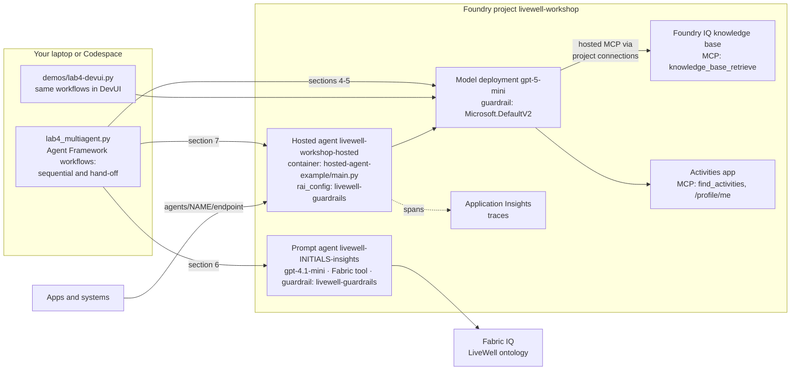
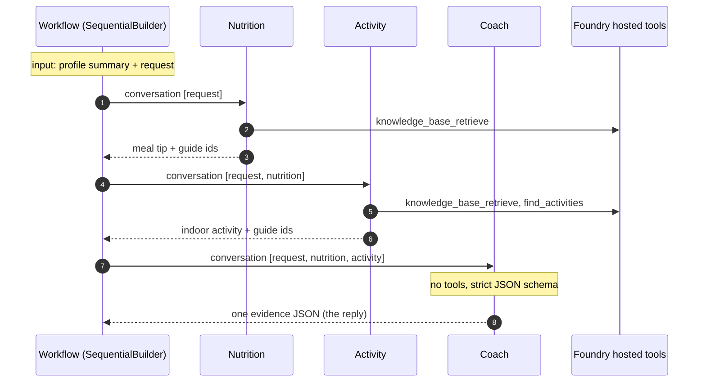
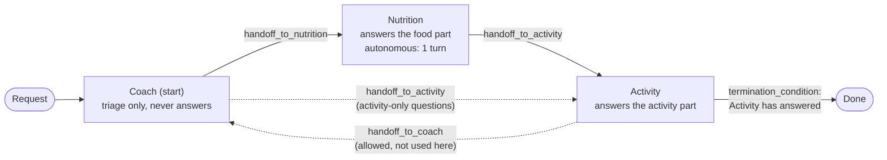
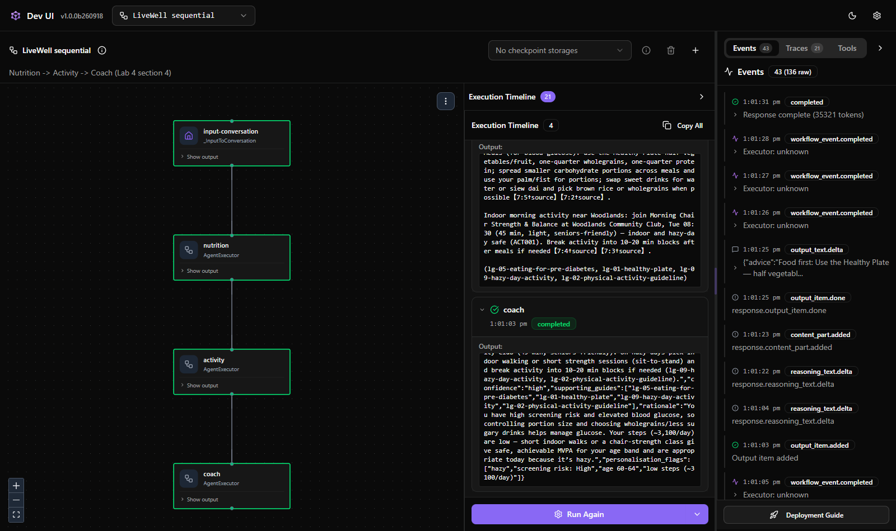
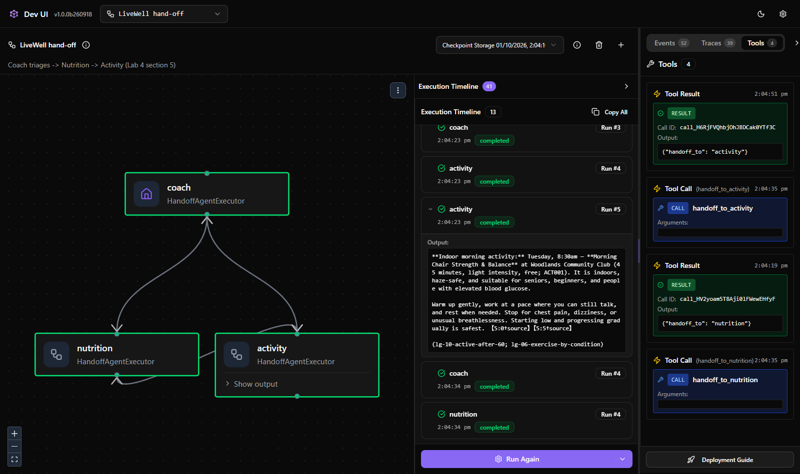
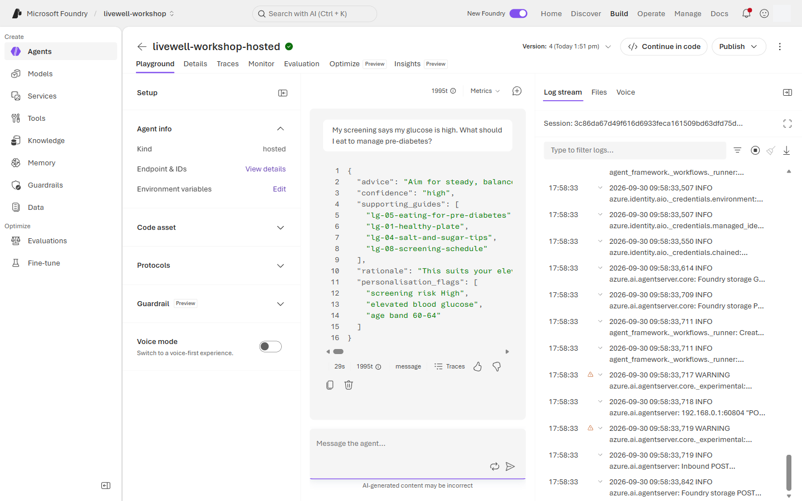
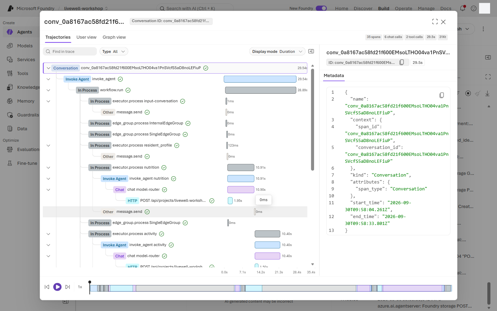
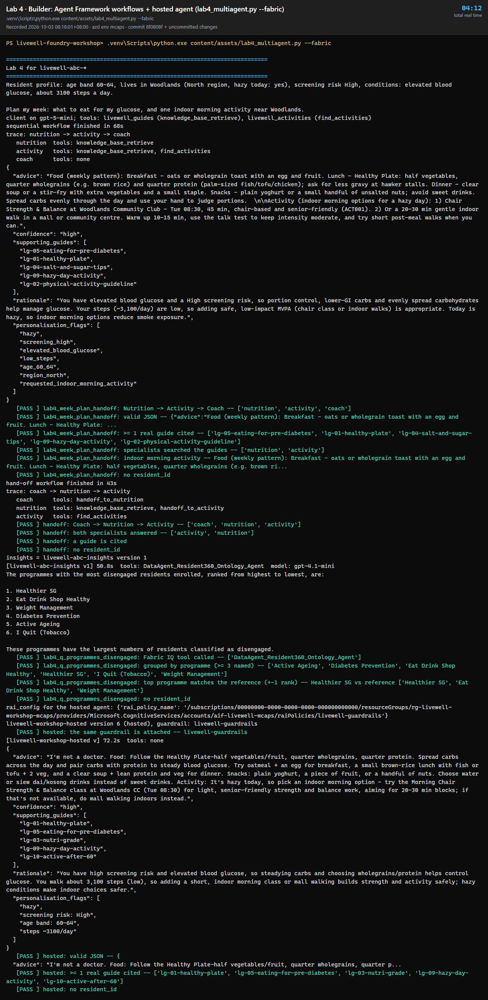

# Lab 4 · Multi-agent & Hosted deploy

**30 min** · **Facilitator demo / Engineer appendix** · **Level:** L300 · **Rails:** 🟢 watch + 🔵 local orchestration · **Patterns:** #3 Workflow Orchestration · #9 Collaboration Between Specialists · #10 Governance & Safety

**You are here:** [Lab 0](lab-00.md) → [Lab 1](lab-01.md) → [Lab 2](lab-02.md) → [Lab 3](lab-03.md) ([Fabric step](fabric-step.md)) → **Lab 4** → [Bridge spotlight](bridge-spotlight.md) · [README](../../README.md)

## Shared objective

> From playground to production: the same agent behind two doors (portal for people, endpoint for systems), governed by the same policy

Patterns: #3 Workflow Orchestration; #9 Collaboration Between Specialists; #10 Governance & Safety.

## Foundry features covered

- Microsoft Agent Framework sequential and handoff orchestration: Nutrition → Activity → Coach, and Coach → Nutrition → Activity.
- Programme-Insights specialist **`livewell-<INITIALS>-insights`** using the Fabric tool for officer questions.
- Agent versioning and trace comparison across local and hosted runs.
- Hosted deploy with `azd deploy` (code deploy: Foundry builds the container; no Docker needed).
- `rai_config` on the hosted agent so the same RAI policy protects the endpoint.
- Hosted-agent tracing in Foundry and Application Insights.
- RBAC ceiling: participants are Foundry User, so publishing is facilitator-only. The hosted agent runs as its own Entra agent identity with Foundry User on the project.

## Story chapter

[Chapter 4](../narrative/rahim.md#chapter-4--livewell-goes-live-lab-4--multi-agent--hosted-deploy) moves LiveWell Coach from playground behaviour to a hosted endpoint. Rahim's week-planning request flows through Nutrition and Activity specialists before returning a single JSON reply. Mei's programme question goes to a Programme-Insights specialist, showing the same agent family serving citizen and officer seats through governed routes.

## 🟢 Navigator

Watch the facilitator demo; here is what to look for:

1. The facilitator opens the local Agent Framework orchestration in **DevUI** (`python demos/lab4-devui.py`) and points out the two shapes: a **sequential** team (Nutrition → Activity → Coach) and a **handoff** team where the Coach triages (Coach → Nutrition → Activity). Each box lights up as that agent runs; [Under the hood](#under-the-hood) below explains what you are seeing.
2. The facilitator adds or shows **`livewell-<INITIALS>-insights`**, the Programme-Insights specialist that uses the Fabric tool for programme-level questions.
3. Send (`lab4_week_plan_handoff`):

   ```text
   Plan my week: what to eat for my glucose, and one indoor morning activity near Woodlands.
   ```

   Look for Nutrition then Activity in the trace, followed by valid JSON with at least one citation.
4. Send (`lab4_q_programmes_disengaged`) to the Programme-Insights specialist:

   ```text
   Which programmes have the most disengaged residents enrolled?
   ```

   Look for a Fabric-routed aggregate answer grouped by programme and no resident-level detail. The reference
   answer puts **<!--ref:q_programmes_disengaged_enrolled.top_programme-->Healthier SG<!--/ref-->** first
   (<!--ref:q_programmes_disengaged_enrolled.top_disengaged_enrolled-->82<!--/ref--> disengaged residents enrolled). The top programmes
   are close, so ±1 rank is a pass.
5. Watch the hosted deploy path. The facilitator runs `azd deploy livewell-workshop-hosted`: Foundry builds the sequential team from `content/assets/hosted-agent-example/`, then a postdeploy step gives the agent's identity Foundry User on the project and attaches **`livewell-guardrails`** with `rai_config`.
6. Smoke test the hosted endpoint (`azd ai agent invoke`, or section 7 of the Builder script). The endpoint is read from the values sheet shown on screen and is never written into this page. Then a blocklisted prompt: it must come back blocked.
7. Open the hosted-agent trace and compare it with the playground trace.
8. Note why participants cannot publish: Foundry User can build and test; Foundry Project Manager is required for hosted publish.

> The Foundry portal **Workflows** item is not used in this workshop because it is retiring on **1 Dec 2026**. Multi-agent orchestration is shown with Microsoft Agent Framework, with specialist agents called through function tools (Builder) and with the A2A tool (Navigator, Lab 3 step 11) instead.

Demo map:

| Moment | What to watch | Why it matters |
|---|---|---|
| Local orchestration | Nutrition runs before Activity | Sequential handoff is explicit, not implied. |
| DevUI hand-off run | The **Tools** tab lists `handoff_to_nutrition` then `handoff_to_activity` | In a hand-off team the model picks the route by calling a tool. |
| Programme-Insights | Officer prompt uses Fabric | Specialist routing keeps citizen and officer data paths separate. |
| Hosted deploy | `rai_config` references the RAI policy; the agent identity gets a role | Governance and least privilege follow the agent into production. |
| Smoke test | JSON plus citation returns from endpoint; the blocklisted prompt is blocked | Systems can consume the same governed behaviour. |
| Hosted trace | Tool spans and policy spans appear | Operations can audit the deployed agent. |

### Under the hood

**What runs where.** The orchestration is Python on your laptop (or Codespace); the models, tools and guardrails are in the Foundry project. Agent Framework sends each agent's turn to a project model deployment through the Responses API. The knowledge base and `find_activities` are *hosted* MCP tools: Foundry calls them server-side through the project connections, so no tool secrets reach your laptop. The hosted agent is the same sequential team, packaged as a container that Foundry runs behind its own endpoint.



**Who does what.** Every agent is a plain `Agent` with an instruction block from [`coach-instructions.md`](../prompts/coach-instructions.md) and a tool list; the builders add the routing.

| Agent | Instruction blocks | Tools | Returns | Code |
|---|---|---|---|---|
| Nutrition | `nutrition` | `knowledge_base_retrieve` | A meal tip under 120 words ending with guide ids, e.g. `(lg-05-eating-for-pre-diabetes)` | [`lab4_multiagent.py` L87-91](../assets/lab4_multiagent.py#L87-L91) |
| Activity | `activity` | `knowledge_base_retrieve`, `find_activities` (read-only) | A safe, indoor-on-hazy-days activity plus guide ids | [L92-94](../assets/lab4_multiagent.py#L92-L94) |
| Coach, sequential | `base`, `safety`, `merge` | none | One evidence JSON (strict schema): `advice`, `confidence`, `supporting_guides`, `rationale`, `personalisation_flags` | [L124-129](../assets/lab4_multiagent.py#L124-L129) |
| Coach, hand-off | `base`, `handoff` | `handoff_to_nutrition`, `handoff_to_activity` (added by `HandoffBuilder`) | Nothing: it only routes | [L164-179](../assets/lab4_multiagent.py#L164-L179) |
| Programme-Insights | `insights` | Fabric tool | Programme-level aggregates, no resident rows | [L203-205](../assets/lab4_multiagent.py#L203-L206) (a Foundry prompt agent, so it runs server-side under `livewell-guardrails`) |

**Sequential: the code decides the route.** `SequentialBuilder` wires the participants in a fixed order and passes one shared conversation down the chain. Each agent sees the request and every earlier answer, adds its own, and hands the longer conversation on. The Coach has no tools and a strict JSON schema, so the last message is always the evidence JSON. `output_from="all"` makes the workflow emit every agent's answer, which is how the script prints the route.



**Hand-off: the model decides the route.** `HandoffBuilder` gives each agent a `handoff_to_<name>` function tool for every target allowed by `add_handoff` (L173-175). An agent hands over by *calling* that tool, and the workflow then makes the target agent active. The instruction block tells the Coach never to answer and to send food-plus-activity requests to Nutrition first. Nutrition runs in **autonomous mode** for one turn: its first reply is the food answer, and on the extra turn it calls `handoff_to_activity` instead of waiting for the resident. The two steps are kept in separate turns on purpose: with "answer, then hand off" in one turn, `gpt-5-mini` often called the hand-off tool and skipped the answer. The `termination_condition` (L170-171) stops the run as soon as Activity has answered. Section 5 checks the route because a model-chosen route can vary; that is the trade-off for flexibility.



**The `text_only` middleware** (L81-84) is the one piece of glue. Each agent's turn contains its own tool calls (MCP calls, hand-off calls), and the next agent must not replay calls it never made. The middleware passes earlier turns on as plain text, keeping who said what (`author_name`).

**The hosted agent is the sequential team in a container.** [`hosted-agent-example/main.py`](../assets/hosted-agent-example/main.py) builds the same three agents from `livewell.json` (L87-100). It puts a small `ResidentProfile` executor first (L58-78), which reads `/profile/me` for the session resident and prepends the profile summary. `SequentialBuilder([...]).build().as_agent()` (L102-104) turns the workflow into one agent, and `ResponsesHostServer` (L108) serves it on the Responses protocol. Foundry builds and runs the container, gives it an Entra agent identity, and applies `rai_config` (`livewell-guardrails`) to every call on its endpoint.

**Watch it run (facilitator).** `python demos/lab4-devui.py` (install `requirements-demos.txt` first) opens [Agent Framework DevUI](https://learn.microsoft.com/agent-framework/integrations/by-component/ui/devui/) on `http://127.0.0.1:8090` with both workflows, and prints the request to paste.

1. Pick **LiveWell sequential** or **LiveWell hand-off** at the top left.
2. Select **Configure & Run**, type `user` in **role**, paste the request into **contents**, then select **Run Workflow**.
3. Each box turns green as that agent finishes. **Execution Timeline** shows each agent's answer. On the right, **Events** is the raw stream, **Traces** lists the spans with each agent's time and tokens, and **Tools** lists the local tool calls, which in the hand-off team are `handoff_to_nutrition` then `handoff_to_activity`. The `knowledge_base_retrieve` and `find_activities` calls are hosted MCP tools that Foundry runs server-side, so DevUI does not list them; their results show up as the large input token counts in **Traces**.

`python demos/lab4-devui.py --mermaid` prints the graphs Agent Framework itself derives (`WorkflowViz`). For the hand-off team it draws every possible edge, not just the configured ones. Likewise, the hand-off timeline lists each agent several times: the workflow broadcasts every turn to all participants so they share one conversation, and only the active agent answers.





Further reading: [sequential orchestration](https://learn.microsoft.com/agent-framework/workflows/orchestrations/sequential) and [handoff orchestration](https://learn.microsoft.com/agent-framework/workflows/orchestrations/handoff) in the Agent Framework docs.

## 🔵 Builder

```bash
INITIALS=abc python content/assets/lab4_multiagent.py
```

```powershell
$env:INITIALS = "abc"
python content\assets\lab4_multiagent.py
```

Or open `content/assets/lab4_multiagent.py` and run it cell by cell in VS Code or Codespaces. The Agent Framework orchestration runs on your machine and calls the project's model deployments directly, so those local agents run under the deployment's guardrail (the platform default), not `livewell-guardrails`; the Foundry agents in the lab (Programme-Insights and the hosted agent) carry `livewell-guardrails` themselves. Hosted deploy remains facilitator-only.

What the script does per section (the diagrams and line-by-line pointers are in [Under the hood](#under-the-hood)):

1. **Request.** The local specialists have no profile tool, so the script reads the session resident's profile with the same function as Lab 3 (`get_citizen_profile("me")`), turns it into a one-line summary and puts it in front of `lab4_week_plan_handoff`. The summary carries no resident_id. The hosted agent does the same step server-side, from the activities app's `/profile/me`.
2. **Client and tools.** One Agent Framework client for the project, plus the Lab 3 tools: the knowledge-base MCP endpoint and `find_activities` (never `register_interest`).
3. **Specialists.** Nutrition and Activity, each with its instruction block. A small `text_only` middleware passes earlier answers on as plain text.
4. **Sequential team.** Nutrition → Activity → Coach; the Coach merges both answers into the Lab 3 evidence JSON. Prints the trace and checks JSON, a real guide citation, an indoor morning activity and no resident_id.
5. **Handoff team** (skip with `--no-handoff`). The Coach triages and hands off to Nutrition, which hands off to Activity. Checks the route and that both specialists answered.
6. **Programme-Insights** (only with `--fabric`, when the facilitator confirms `FABRIC_BRIDGE=true`). Creates **`livewell-<INITIALS>-insights`** with the Fabric tool and asks `lab4_q_programmes_disengaged`; checks the top programme against the reference answer.
7. **Hosted agent.** Once the facilitator has deployed **`livewell-workshop-hosted`**, sends it the same week-plan prompt on its own endpoint and checks that its guardrail is **`livewell-guardrails`**, the reply is evidence JSON with a real guide, and no resident_id appears. Before the deploy it just says "not deployed yet".
8. **Checkpoint.** Prints your key results under **CHECKPOINT** and saves the run to `content/assets/.runs/lab4-<initials>.json`.

Use `--verbose` for each agent's full answer. Use `--cleanup` to delete only `livewell-<INITIALS>-*` agents (the hosted agent has a protected name and is never deleted). Retype lines are marked `# 👉`.

### How the code works

[Under the hood](#under-the-hood) has the diagrams and the agent table. This is the short map from each script section to the code that does the work.

| Section | Code | What it does |
|---|---|---|
| 1 | [L56-L58](../assets/lab4_multiagent.py#L56-L58), [`profile_summary`](../assets/common/livewell_common.py#L547-L552) | Builds the request: one profile line plus the prompt. |
| 2 | [`af_client`](../assets/common/livewell_common.py#L1097-L1108), [`af_kb_tool` and `af_activities_tool`](../assets/common/livewell_common.py#L1111-L1122) | A `FoundryChatClient` on the project's model deployment, and the two hosted MCP tools from `client.get_mcp_tool`. `allowed_tools` keeps Activity to `find_activities`. |
| 3 | [`text_only` and `team()`](../assets/lab4_multiagent.py#L80-L95) | Agent middleware that strips other agents' tool calls (but keeps the agent's own hand-off result, so a second turn still has input), and a factory for fresh Nutrition and Activity agents. An agent instance belongs to one workflow, so each workflow builds its own. |
| 4 | [`sequential()`](../assets/lab4_multiagent.py#L124-L129), [run and checks](../assets/lab4_multiagent.py#L132-L152) | `SequentialBuilder` in a fixed order. The Coach's strict schema comes from [`af_json_format`](../assets/common/livewell_common.py#L1125-L1128), the same evidence contract as Lab 3. |
| 5 | [`handoff()`](../assets/lab4_multiagent.py#L164-L179) | `HandoffBuilder`: who may hand off to whom, the start agent, one autonomous turn for Nutrition and a stop condition. |
| 6 | [L203-L209](../assets/lab4_multiagent.py#L203-L210) | Not Agent Framework: a Foundry prompt agent with the Fabric tool, created and asked exactly as in Lab 3. |
| 7 | [L237-L260](../assets/lab4_multiagent.py#L238-L261) | Finds `livewell-workshop-hosted`, checks its guardrail, and sends it the week-plan prompt. |

Two helpers do the plumbing:

- [`af_run`](../assets/common/livewell_common.py#L1156-L1182) builds a **fresh** workflow, runs it with `await workflow.run(request)` and collects every output message. A 429 or a model error re-runs the whole workflow, because a half-finished hand-off cannot be resumed.
- [`af_steps`](../assets/common/livewell_common.py#L1131-L1146) turns those messages into the printed trace: who spoke (`author_name`), in order, and which tools each speaker called.

`lw.ask` knows that a hosted agent only answers on its own endpoint. For `livewell-workshop-hosted` it uses an OpenAI client for `{project}/agents/<name>/endpoint/protocols/openai` ([`_openai_agent`](../assets/common/livewell_common.py#L381-L383)). For a prompt agent it sends an `agent_reference` instead.

Engineer appendix notes:

- `content/assets/hosted-agent-example/` packages section 4 as a hosted agent: `main.py` (about 100 lines), `livewell.json` (instructions, tools and schema, generated from the same prompt blocks) and a pinned `requirements.txt`. Its [README](../assets/hosted-agent-example/README.md) covers deploy, smoke test, local runs and troubleshooting.
- Hosted agents answer only on their own endpoint, `{project endpoint}/agents/<name>/endpoint/protocols/openai`; the project's Responses endpoint with an `agent_reference` is refused.
- The facilitator reads endpoint values from the values sheet or environment only.
- Participants can still run the Agent Framework orchestration locally without hosted publish rights.
- Any production channel setup is outside the participant checkpoint.
- Keep local orchestration output for comparison with the hosted trace.

## Checkpoint

✅ **Built** or watched a multi-agent orchestration with governed handoffs.

✅ **Did** a hosted-agent smoke test if you are the facilitator, or inspected the live trace as a participant.

✅ **Learned** what changes when an agent moves from playground to endpoint: RBAC, policy attachment, versioning and operational traces.

There is nothing to submit. Try the steps first, then open **Expected output** to compare.

<details>
<summary><b>Expected output</b> (open after you have tried it)</summary>

**What this demonstrates.** One request can be split across specialists, and you choose who decides the route. In the sequential team your code fixes the order. In the hand-off team the model picks the next agent by calling a `handoff_to_…` tool. Either way, the resident gets one merged answer with the same evidence contract as Lab 3. Officer questions go to a separate Programme-Insights agent with Fabric access, so citizen and officer data paths never mix. Packaged as a hosted agent, the same team runs behind its own endpoint with the workshop guardrail, an agent identity and traces.

**Hosted agent playground.** The food prompt returns evidence JSON with real guide ids. The log stream on the right shows the container's own logs (Agent Framework workflow runner, agent server).



**Hosted trace.** `workflow.run` contains one `executor.process` span per step: `resident_profile` first, then `nutrition`, `activity` and the coach. Each agent has its own `invoke_agent` and `chat` span. That is the sequential team, seen from production.



**DevUI** (facilitator demo): see the two screenshots at the end of [Under the hood](#under-the-hood).

**Builder.** Look for:

- `trace: nutrition -> activity -> coach`, with `coach tools: none`, then one evidence JSON;
- `trace: coach -> nutrition -> activity`, with `handoff_to_nutrition` and `handoff_to_activity` in the tool lists: the model chose that route;
- with `--fabric`: `livewell-<INITIALS>-insights` calls the Fabric data agent and returns a table by programme, with no resident rows;
- `livewell-workshop-hosted version N (hosted), guardrail: livewell-guardrails`, then a hosted reply with real guide ids;
- PASS on every line.



</details>

## Troubleshooting

| Symptom | Fix |
|---|---|
| Participant cannot publish | Expected. Hosted publish needs Foundry Project Manager; watch the facilitator demo. |
| Section 7 says the hosted agent is not deployed yet | Expected before the facilitator demo; re-run the cell afterwards. |
| Section 7: 424 `session_not_ready` | The hosted agent is cold-starting; wait a minute and re-run. If it persists, the facilitator checks the container log (hosted-agent README). |
| Section 7: guardrail check fails | Facilitator: `python scripts/hosted-postdeploy.py --verify` re-attaches **`livewell-guardrails`** and checks a blocked prompt. |
| Trace shows only one specialist | Re-run the Agent Framework script and check the handoff rule; the week-plan prompt should require both Nutrition and Activity. |
| `Workflow is already running` | One request at a time per workflow; re-run the cell. |
| Programme-Insights calls the knowledge base instead of Fabric | Re-copy the fabric routing block in the specialist instructions and confirm the Fabric tool is attached. |
| Endpoint smoke test returns prose | The hosted agent's `livewell.json` is stale: the facilitator runs `python scripts/gen-schemas.py` and redeploys. |
| 429 or quota errors | Wait 30 seconds and re-run, or reduce concurrent participant runs. For the demo, set `LIVEWELL_MODEL=gpt-4.1-mini` to move the team to the tools deployment. |

## Where next

Close with [Bridge spotlight · Two IQs, one agent](bridge-spotlight.md), or revisit the optional [Fabric step](fabric-step.md) if the bridge was skipped earlier. Keep [README](../../README.md) open for post-workshop resources.
